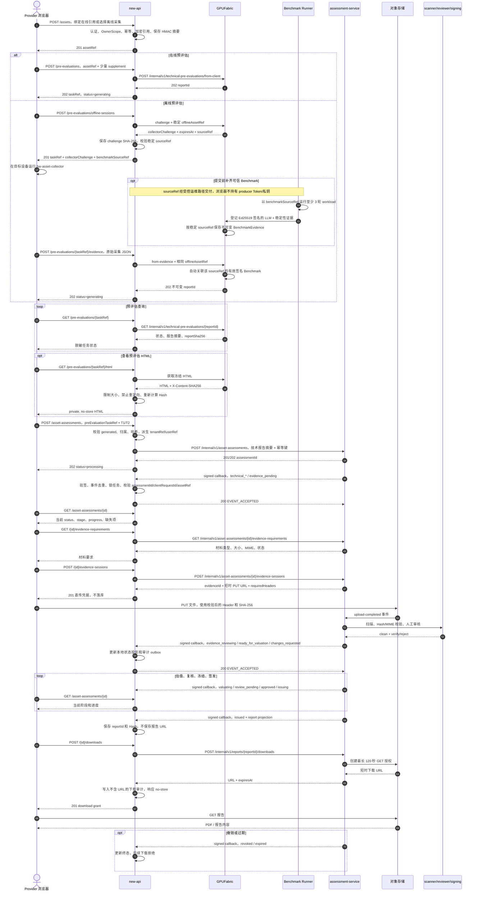
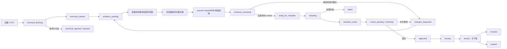

# new-api 资产预评估与正式评估开发 API 契约

> 状态：开发冻结稿（v1）
> 更新日期：2026-07-21
> 适用仓库：`new-api`（依赖分支：`feature/banking-integration`）
> 对接服务：GPUFabric、asset-assessment-service
> 机器可读契约：[`new-api-asset-assessment.openapi.yaml`](./new-api-asset-assessment.openapi.yaml)

## 1. 目标与边界

本文定义 new-api 面向浏览器的资产评估 API，以及调用 GPUFabric、asset-assessment-service
和接收状态回调时必须遵守的契约。

闭环分为两段：

1. **预评估**：绑定 GPUFabric 在线资产，或提交一次离线采集结果，由 GPUFabric 生成技术预评估。
   该阶段以自动采集为主，只允许用户补充资产名称等少量非技术信息。
2. **正式评估**：基于已校验的预评估发起 T1/T2 评估，根据要求向 assessment-service
   指定的对象存储直传权属、财务和合规材料，等待审核、估值、签发并下载报告。

new-api 是身份、租户、任务视图和审计编排层，不负责生成技术证据、保存正式材料、计算估值、
生成/签发/撤销报告，也不能向浏览器暴露下游 Bearer Token。

## 1.1 全链路交互流程图

下面的时序图覆盖资产绑定、在线/离线预评估、正式评估、材料直传、签名回调和报告下载。



图源：[Mermaid 源文件](asset-assessment-sequence.mmd)。

正式评估的状态和回调投影如下：



图源与渲染文件：[Mermaid 源文件](asset-assessment-state.mmd) · [SVG](asset-assessment-state.svg)

预评估只采集技术事实，用户最多补充资产名称等少量业务信息。只有 `generated` 状态的预评估
才能发起正式评估。每个 assessment-service 状态变化都必须通过签名回调进入 `new-api`；
`new-api` 校验事件、绑定关系和状态跃迁后，才更新自己的 `status/stage/progress` 投影。

## 2. 冻结决策

| 项目 | 决策 |
|---|---|
| 浏览器 API 前缀 | `/api/banking/provider` |
| 正式评估资源名 | `asset-assessments`，不再使用 `asset-evaluations` |
| 回调路径 | `/api/banking/callback/assessment`，路径参与签名，不能改写 |
| 外部公开标识 | ULID/不透明服务 ID，不暴露 new-api 自增主键 |
| 租户输入 | 浏览器不能提交 `tenantRef/userRef`，必须从登录态派生 |
| 幂等 | 写请求带 `Idempotency-Key`；有 `clientRequestId` 时两者必须相同 |
| HTTP 语义 | 使用真实 HTTP 状态码，不使用“全部 HTTP 200”的旧封装 |
| JSON 解码 | 拒绝未知字段，请求超限返回 `413` |
| 正式材料 | 使用 assessment-service 短时 PUT URL 直传，new-api 不落盘、不转存 |
| 下载 URL | 最长 120 秒，不入库、不记录日志，响应 `Cache-Control: no-store` |
| 下游引用 | 版本化 HMAC/AEAD，禁止固定 `default` 和硬编码密钥回退 |

## 3. 认证、授权与通用协议

### 3.1 浏览器认证

所有 `/api/banking/provider/**` 路由按以下顺序执行：

```text
GlobalAPIRateLimit -> UserAuth -> BankingProviderRole -> Handler
```

当前用户从 Gin Context 的 `c.GetInt("id")` 读取。Access Token 方式继续遵守现有
`New-Api-User` 请求头约束。Controller 不接受 `userId/ownerUserId/tenantId` 覆盖登录身份。

第一期尚无独立租户模型：

```text
tenant_scope_type = "user"
tenant_scope_id   = authenticated user id
owner_user_id     = authenticated user id
```

以后通过 OwnerScope 解析器扩展企业租户。所有 DAO 查询必须在 SQL 层同时绑定上述所有权字段
和资源 ID。资源不属于当前用户时统一返回 `404 RESOURCE_NOT_FOUND`，避免泄露资源存在性。

### 3.2 幂等

写请求头：

```http
Idempotency-Key: 01K0...
X-Request-ID: optional-client-trace-id
Content-Type: application/json
```

- Key 长度 16-128，只允许 `[A-Za-z0-9._:-]`。
- 请求体含 `clientRequestId` 时必须完全相同，否则 `400`。
- 作用域为 `tenant + owner + operation + key`。
- 首次请求保存规范化请求摘要；同 key 同摘要返回原结果；同 key 不同摘要返回 `409`。
- 传给下游的 Key 必须稳定，进程重启和自动重试时不能变化。

### 3.3 响应

成功：

```json
{"success":true,"code":"OK","message":"","data":{},"requestId":"req_01K0..."}
```

失败：

```json
{
  "success": false,
  "code": "ASSESSMENT_EVIDENCE_INVALID",
  "message": "材料的大小或摘要不符合要求",
  "retryable": false,
  "details": {"field": "sha256"},
  "requestId": "req_01K0..."
}
```

不得把下游响应体、对象存储 URL、令牌、签名、堆栈或 SQL 错误放入响应。列表统一使用
`page`（默认 1）和 `pageSize`（默认 20，最大 100），返回
`{"items":[],"page":1,"pageSize":20,"total":0}`。

## 4. 浏览器 API 总览

| 方法 | 路径 | 用途 |
|---|---|---|
| POST | `/api/banking/provider/assets` | 创建在线或离线资产绑定 |
| GET | `/api/banking/provider/assets` | 查询本人资产 |
| GET | `/api/banking/provider/assets/{assetRef}` | 查询资产详情 |
| DELETE | `/api/banking/provider/assets/{assetRef}` | 禁用资产绑定 |
| POST | `/api/banking/provider/pre-evaluations` | 发起在线预评估 |
| POST | `/api/banking/provider/pre-evaluations/offline-sessions` | 获取离线采集挑战 |
| POST | `/api/banking/provider/pre-evaluations/{taskRef}/evidence` | 提交离线采集 JSON |
| GET | `/api/banking/provider/pre-evaluations` | 查询预评估列表 |
| GET | `/api/banking/provider/pre-evaluations/{taskRef}` | 查询预评估详情 |
| GET | `/api/banking/provider/pre-evaluations/{taskRef}/html` | 查看校验后的 HTML |
| POST | `/api/banking/provider/asset-assessments` | 发起 T1/T2 正式评估 |
| GET | `/api/banking/provider/asset-assessments` | 查询正式评估列表 |
| GET | `/api/banking/provider/asset-assessments/{assessmentId}` | 查询详情和进度 |
| GET | `/api/banking/provider/asset-assessments/{assessmentId}/evidence-requirements` | 获取材料要求 |
| POST | `/api/banking/provider/asset-assessments/{assessmentId}/evidence-sessions` | 申请材料直传凭据 |
| POST | `/api/banking/provider/asset-assessments/{assessmentId}/downloads` | 创建报告下载授权 |
| POST | `/api/banking/callback/assessment` | assessment-service 状态回调 |

## 5. 资产绑定 API

### 5.1 创建资产

`POST /api/banking/provider/assets`

```json
{
  "clientRequestId": "01K0ASSET00000000000000001",
  "displayName": "训练节点 A",
  "source": {
    "type": "gpuf_online",
    "gpufUserRef": "gpuf-user-visible-reference",
    "gpufClientRef": "gpuf-client-visible-reference"
  }
}
```

离线资产的 `source` 仅包含 `{"type":"offline_collector"}`。约束：

- `displayName` 为 1-100 个 UTF-8 字符；
- `gpuf_online` 必须同时提供两个 GPUFabric 引用；
- `offline_collector` 禁止提供在线引用；
- 原始引用使用 AEAD 加密，仅在调用 GPUFabric 时解密；
- 另存 HMAC 查询摘要用于去重，禁止明文或普通 SHA-256；
- 重复绑定返回原 `assetRef`，不创建第二条活动记录。

响应 `201 Created`：

```json
{
  "success": true,
  "code": "OK",
  "message": "",
  "data": {
    "assetRef": "ast_01K0...",
    "displayName": "训练节点 A",
    "sourceType": "gpuf_online",
    "status": "active",
    "createdAt": "2026-07-20T10:00:00Z"
  },
  "requestId": "req_01K0..."
}
```

查询只能返回脱敏信息。`DELETE /assets/{assetRef}` 要求 `Idempotency-Key`。存在非终态任务时
返回 `409 ASSET_HAS_ACTIVE_TASKS`；成功返回 `204`。禁用是软删除，历史任务仍可查询。

## 6. 技术预评估 API

### 6.1 在线预评估

`POST /api/banking/provider/pre-evaluations`

```json
{
  "clientRequestId": "01K0PRE000000000000000001",
  "assetRef": "ast_01K0...",
  "supplement": {"assetName": "训练节点 A"}
}
```

第一版 `supplement` 只允许 `assetName`，禁止提交硬件参数、跑分、显存或设备标识。
new-api 先在本地事务中建立任务和摘要，再解密 GPUFabric 引用并调用下游。固定响应
`202 Accepted`：

```json
{
  "success": true,
  "code": "ACCEPTED",
  "message": "",
  "data": {
    "taskRef": "pre_01K0...",
    "assetRef": "ast_01K0...",
    "sourceType": "gpuf_online",
    "status": "generating",
    "createdAt": "2026-07-20T10:01:00Z"
  },
  "requestId": "req_01K0..."
}
```

### 6.2 离线采集会话

`POST /api/banking/provider/pre-evaluations/offline-sessions`

```json
{
  "clientRequestId": "01K0OFF000000000000000001",
  "assetRef": "ast_01K0...",
  "assetName": "隔离区节点 B"
}
```

new-api 调用 GPUFabric challenge，只保存 `SHA-256(challenge)`、过期时间和归属，不记录
challenge。响应 `201`：

```json
{
  "success": true,
  "code": "OK",
  "message": "",
  "data": {
    "taskRef": "pre_01K0...",
    "status": "collecting",
    "collectorChallenge": "opaque-challenge",
    "benchmarkSourceRef": "64-lowercase-hex",
    "expiresAt": "2026-07-20T10:07:00Z"
  },
  "requestId": "req_01K0..."
}
```

GPUFabric 当前挑战有效期为 300 秒；过期后创建新任务。

`benchmarkSourceRef` 来自固定 HMAC key 版本下的脱敏离线资产引用，同一资产跨 challenge
保持稳定，不等于本次 collector 的 `payloadSha256`。受控 Runner 如需补齐可信基准，必须
在提交同一份 collector JSON 前用该值登记签名证据；浏览器不得提交任意性能数值或持有
Benchmark producer Token/私钥。

### 6.3 提交离线证据

`POST /api/banking/provider/pre-evaluations/{taskRef}/evidence`

请求体是采集器原始 JSON，`Content-Type: application/json`，最大 4 MiB。必须：

- 先校验任务归属、状态和过期时间，再读取有限大小 Body；
- 不反序列化后重新编码，不修改字段和空白；
- 原始字节只转发给 GPUFabric，不落库、不落盘、不写日志/APM；
- 重复提交相同摘要返回原任务，不同摘要返回 `409 IDEMPOTENCY_CONFLICT`。

响应 `202`，格式与在线预评估任务相同。

### 6.4 查询和 HTML

`GET /pre-evaluations/{taskRef}`：

```json
{
  "success": true,
  "code": "OK",
  "message": "",
  "data": {
    "taskRef": "pre_01K0...",
    "assetRef": "ast_01K0...",
    "sourceType": "gpuf_online",
    "status": "generated",
    "report": {
      "reportId": "rpt_...",
      "schemaVersion": "gpuf.pre_evaluation.v1",
      "reportSha256": "64-lowercase-hex",
      "reportHtmlSha256": "64-lowercase-hex",
      "hashProfile": "sha256-raw-utf8-v1",
      "technicalSnapshotId": "snap_...",
      "technicalSnapshotSha256": "64-lowercase-hex",
      "technicalSnapshotSchemaVersion": "technical_asset_snapshot.v2"
    },
    "summary": {"gpuCount":8,"health":"healthy","benchmarkEvidenceCount":2},
    "createdAt": "2026-07-20T10:01:00Z",
    "completedAt": "2026-07-20T10:01:08Z"
  },
  "requestId": "req_01K0..."
}
```

任务状态：`requested | collecting | generating | generated | failed | expired`。只有
`generated` 可用于正式评估，完整 `reportJson` 不在 new-api 落库。

`GET /pre-evaluations/{taskRef}/html` 由 new-api 获取冻结 HTML，重新计算原始响应字节 SHA-256。
最大 8 MiB，禁止跨主机重定向。响应必须包含：

```http
Content-Type: text/html; charset=utf-8
Cache-Control: private, no-store
Content-Security-Policy: default-src 'none'; style-src 'unsafe-inline'; img-src data:
X-Content-Type-Options: nosniff
```

摘要不符返回 `502 UPSTREAM_INTEGRITY_FAILED`。

## 7. 正式评估 API

### 7.1 发起正式评估

`POST /api/banking/provider/asset-assessments`

```json
{
  "clientRequestId": "01K0ASM000000000000000001",
  "assetRef": "ast_01K0...",
  "preEvaluationTaskRef": "pre_01K0...",
  "requestedTier": "T2",
  "purpose": ["credit", "insurance"]
}
```

约束：

- `requestedTier` 只能是 `T1/T2`；
- `purpose` 为服务端白名单中的非空去重数组；
- 预评估属于同一用户、同一资产且状态为 `generated`；
- 预评估哈希从可信本地记录组装，浏览器不能覆盖；
- `tenantRef/userRef` 由版本化 HMAC 派生；
- `callback.urlRef` 从服务端配置读取。

响应 `202 Accepted`：

```json
{
  "success": true,
  "code": "ACCEPTED",
  "message": "",
  "data": {
    "taskRef": "asm_01K0...",
    "assessmentId": "asm_service_...",
    "assetRef": "ast_01K0...",
    "requestedTier": "T2",
    "status": "processing",
    "stage": "technical_fetching",
    "progress": 5,
    "createdAt": "2026-07-20T10:05:00Z"
  },
  "requestId": "req_01K0..."
}
```

### 7.2 查询评估

`GET /asset-assessments/{assessmentId}`：

```json
{
  "success": true,
  "code": "OK",
  "message": "",
  "data": {
    "taskRef": "asm_01K0...",
    "assessmentId": "asm_service_...",
    "assetRef": "ast_01K0...",
    "requestedTier": "T2",
    "status": "action_required",
    "stage": "evidence_pending",
    "progress": 30,
    "requiredEvidenceCodes": ["ownership_certificate", "purchase_invoice"],
    "report": null,
    "error": null,
    "upstreamSyncedAt": "2026-07-20T10:06:00Z",
    "createdAt": "2026-07-20T10:05:00Z",
    "updatedAt": "2026-07-20T10:06:00Z"
  },
  "requestId": "req_01K0..."
}
```

优先返回本地回调投影；超过 30 秒未同步且非终态时可向下游对账。上游不可用时，有缓存则返回
并加 `stale:true`，无缓存才返回 `503`。

### 7.3 材料要求

`GET /asset-assessments/{assessmentId}/evidence-requirements`

```json
{
  "success": true,
  "code": "OK",
  "message": "",
  "data": {
    "assessmentId": "asm_service_...",
    "items": [{
      "code": "ownership_certificate",
      "reason": "采购合同、发票或其他有效权属文件",
      "required": true,
      "allowedContentTypes": ["application/pdf", "image/jpeg", "image/png"],
      "maximumBytes": 20971520,
      "status": "missing"
    }]
  },
  "requestId": "req_01K0..."
}
```

先校验本地任务归属再调用下游，不得硬编码材料类型或大小。

### 7.4 申请材料直传

`POST /asset-assessments/{assessmentId}/evidence-sessions`

```json
{
  "clientRequestId": "01K0EVD000000000000000001",
  "evidenceType": "ownership_certificate",
  "contentType": "application/pdf",
  "contentLength": 1048576,
  "fileName": "purchase-invoice.pdf",
  "sha256": "0123456789abcdef0123456789abcdef0123456789abcdef0123456789abcdef"
}
```

new-api 将 `sha256` 设为必填。文件名取 basename；控制字符或超过 200 字节时拒绝。响应 `201`：

```json
{
  "success": true,
  "code": "OK",
  "message": "",
  "data": {
    "evidenceId": "evd_...",
    "uploadMethod": "PUT",
    "uploadUrl": "https://object-store.example/signed?...",
    "expiresAt": "2026-07-20T10:17:00Z",
    "requiredHeaders": {
      "Content-Type": "application/pdf",
      "x-oss-content-sha256": "0123...cdef"
    },
    "maximumBytes": 20971520
  },
  "requestId": "req_01K0..."
}
```

上传授权必须使用 HTTPS、PUT、最长 15 分钟，且 `maximumBytes` 不得超过当前材料要求；仅允许 `Content-Type`、`Content-MD5`、`x-amz-*` 和 `x-oss-*` 签名请求头。浏览器原样使用校验后的方法和全部请求头。new-api 不保存/缓存 `uploadUrl`，日志删除查询参数，响应设置
`no-store/no-cache/no-referrer`。正式材料不经过 new-api OSS。

### 7.5 创建报告下载授权

`POST /asset-assessments/{assessmentId}/downloads`

```json
{"clientRequestId":"01K0DWL000000000000000001","purpose":"customer_download"}
```

仅本人、`stage=issued` 且报告有效时可申请。new-api 使用独立报告下载凭据。响应 `201`：

```json
{
  "success": true,
  "code": "OK",
  "message": "",
  "data": {
    "downloadGrantId": "grant_...",
    "method": "GET",
    "url": "https://object-store.example/signed?...",
    "expiresAt": "2026-07-20T10:12:00Z"
  },
  "requestId": "req_01K0..."
}
```

URL 最大有效期 120 秒。new-api 只保存不含 URL 的审计，禁止长期或 7 天 URL。

## 8. 调用 GPUFabric

基础地址 `GPUFABRIC_BASE_URL`，请求头含
`Authorization: Bearer <GPUFABRIC_BANKING_TOKEN>` 和稳定 `Idempotency-Key`。

### 8.1 在线

`POST /internal/v1/technical-pre-evaluations/from-client`

```json
{
  "gpufUserRef": "decrypted-reference",
  "gpufClientRef": "decrypted-reference",
  "tenantRef": "hmac:v1:...",
  "clientRequestId": "01K0PRE...",
  "benchmarkEvidenceIds": []
}
```

`benchmarkEvidenceIds: []` 不是“禁用基准”。GPUFabric 会按该设备的技术 `sourceRef` 自动选择每个 metric 最新且未过期的一条已验签证据；new-api 不需要增加证据选择接口，也不能由浏览器提交跑分 ID。显式非空数组仅用于受控运维回放，并由 GPUFabric 严格校验设备绑定和有效期。

GPUFabric 当前拒绝非空 `supplements`，new-api 不把浏览器补充字段透传为技术事实。

### 8.2 离线

`POST /internal/v1/technical-pre-evaluations/challenge`

```json
{
  "clientRequestId": "01K0OFF...",
  "tenantRef": "hmac:v1:...",
  "offlineAssetRef": "offline-asset:hmac:v1:<opaque>"
}
```

`offlineAssetRef` 由 new-api 根据用户、资产和任务固定的 HMAC key 版本派生，不由浏览器提交。GPUFabric 响应核心字段为 `challenge/expiresAt`，新版可额外返回 `sourceRef` 供完整性校验；new-api 本地按固定 profile 计算相同的 `benchmarkSourceRef`。

`POST /internal/v1/technical-pre-evaluations/from-evidence`

```json
{
  "hardwareEvidenceJson": "<collector JSON as a JSON string>",
  "offlineAssetRef": "offline-asset:hmac:v1:<opaque>",
  "tenantRef": "hmac:v1:...",
  "clientRequestId": "01K0OFF...",
  "assetName": "隔离区节点 B",
  "benchmarkEvidenceIds": []
}
```

离线流程同样使用自动关联语义，正确顺序是：创建离线 session、在设备上用 challenge 生成 collector JSON、受控 runner 使用 session 返回的 `benchmarkSourceRef` 跑分并登记签名证据，最后提交同一份未修改的 collector JSON。`payloadSha256` 只绑定本次 challenge 的采集内容；稳定 `sourceRef` 绑定同一用户的同一资产，因此跨 challenge 仍能关联已验签且未过期的 Benchmark。

如果不运行 runner，预评估仍可生成，但会如实保留 `TRUSTED_BENCHMARK_MISSING`。报告和技术快照生成后不可变；若先提交后补跑分，必须重新创建离线 session、重新采集并用新的幂等键生成报告，不能期待旧报告被追加修改。

### 8.3 读取

- `GET /internal/v1/technical-pre-evaluations/{reportId}`
- `GET /internal/v2/technical-snapshots/{snapshotId}`
- `GET /api/banking/provider/pre-evaluations/{reportId}/html`

报告返回 `reportId/schemaVersion/reportSha256/hashProfile`、可选 HTML 摘要、
`reportJson/report`。摘要按声明的原始 UTF-8 字节计算，禁止重新序列化后计算。完整字段见
[`gpufabric-assessment-api.md`](./gpufabric-assessment-api.md)。

技术快照可能包含 `assetConfiguration`（`gpuf.asset_configuration.v1`）。new-api 只保存已有快照 ID/Hash/schema 引用，不保存或自行计算该配置；assessment-service 会读取已验 Hash 的快照、按 `gpuf.asset-configuration-lines.v1` 独立重算配置 Hash，并在估值时绑定市场快照。

## 9. 调用 assessment-service

所有请求还必须发送 `X-Service-Subject`、派生后的 `X-Tenant-Ref` 和 `X-Request-ID`；写接口按下游 OpenAPI 发送 `X-Correlation-ID` 和 `Idempotency-Key`。Subject 与 Token 绑定，不能只发送 Bearer Token，也不能让浏览器控制这些请求头。
普通 Token 最小 scope：

```text
assessment:create assessment:read assessment:evidence
```

报告下载使用独立 Token，最小 scope：

```text
assessment:report:read assessment:report:download
```

### 9.1 创建评估

`POST /internal/v1/asset-assessments`

```json
{
  "clientRequestId": "01K0ASM...",
  "correlationId": "req_01K0...",
  "tenantRef": "hmac:v1:...",
  "userRef": "hmac:v1:...",
  "assetRef": "ast_01K0...",
  "requestedTier": "T2",
  "purpose": ["credit", "insurance"],
  "preEvaluation": {
    "provider": "gpufabric",
    "reportId": "rpt_...",
    "reportSha256": "64-lowercase-hex",
    "reportHtmlSha256": "64-lowercase-hex",
    "schemaVersion": "gpuf.pre_evaluation.v1",
    "technicalSnapshotId": "snap_...",
    "technicalSnapshotSha256": "64-lowercase-hex",
    "technicalSnapshotSchemaVersion": "technical_asset_snapshot.v2"
  },
  "callback": {"urlRef": "new-api-assessment-callback-v1"}
}
```

HTML 摘要和快照三字段按实际返回整组包含或整组省略，不能填空字符串。

assessment-service 的评估详情新增两个可选只读字段：`technicalVerification.assetConfiguration` 和 `assetCondition`。前者来自已验证 GPUFabric 快照；后者只有独立审核端根据 `asset.lifecycle` 材料提交结构化 `lifecycleFacts` 并审核通过后才出现。它们是加法字段，当前 new-api 状态编排无需新增 API 或前端输入，也不得把用户自报成色直接映射为正式 `assetCondition`。

独立 Reviewer 调用 `POST /internal/v1/asset-assessments/{assessmentId}/evidence/{evidenceId}/review-actions` 验证 `asset.lifecycle` 时，请求示例：

```json
{
  "clientRequestId": "review_lifecycle_01K0...",
  "action": "verify",
  "lifecycleFacts": {
    "condition": "good",
    "manufacturedAt": "2024-03-01T00:00:00Z",
    "commissionedAt": "2024-04-15T00:00:00Z",
    "warrantyUntil": "2027-04-15T00:00:00Z"
  }
}
```

该字段只属于材料审核服务身份，不增加 new-api 面向用户的写接口。成色与市场快照不一致、技术配置 Hash/字段不一致或旧快照没有配置时，assessment-service 拒绝估值。

### 9.2 真实路径

| new-api 动作 | assessment-service 当前路径 |
|---|---|
| 查询评估 | `GET /internal/v1/asset-assessments/{assessmentId}` |
| 查询材料要求 | `GET /internal/v1/asset-assessments/{assessmentId}/evidence-requirements` |
| 创建材料会话 | `POST /internal/v1/asset-assessments/{assessmentId}/evidence-sessions` |
| 查询报告元数据 | `GET /internal/v1/reports/{reportId}` |
| 创建下载授权 | `POST /internal/v1/reports/{reportId}/downloads` |

下载路径不是 `/asset-assessments/{assessmentId}/report-downloads`。创建下载授权只发送
`{"clientRequestId":"..."}`，且 `Idempotency-Key` 相同。

### 9.3 已实现的报告关联契约

assessment-service 已实现 `AS-EXT-001`：评估详情在报告签发后返回可选 `report`，
`issued/revoked/expired` 回调携带同一强类型投影。new-api 以该投影取得下载所需的
`reportId`，不得扫描数据库、猜测 ID 或调用 issue/revoke 绕过正常权限边界。

当前结构：

```json
{
  "reportId": "rpt_...",
  "reportStatus": "issued",
  "reportJsonSha256": "64-lowercase-hex",
  "reportHtmlSha256": "64-lowercase-hex",
  "reportPdfSha256": "64-lowercase-hex",
  "issuedAt": "2026-07-20T10:30:00Z",
  "validUntil": "2027-07-20T10:30:00Z",
  "downloadAvailable": true
}
```

撤销事件增加 `revokedAt`，过期事件增加 `expiredAt`，两者的 `downloadAvailable` 必须为 false。
报告仍为 frozen 时评估详情不返回该投影。完整内部字段以 assessment-service 的
`openapi.yaml` 为准，双方 CI 加入契约测试。

## 10. assessment-service 回调

### 10.1 请求

```http
POST /api/banking/callback/assessment
Content-Type: application/json
X-Event-ID: evt_01K0...
X-Event-Timestamp: 1784543400
X-Event-Signature: v1=<lowercase-hex-hmac-sha256>
```

```json
{
  "eventId": "evt_01K0...",
  "eventType": "asset_assessment.status_changed",
  "schemaVersion": "asset_assessment_event.v1",
  "occurredAt": "2026-07-20T10:10:00Z",
  "correlationId": "req_01K0...",
  "assessmentId": "asm_service_...",
  "clientRequestId": "01K0ASM...",
  "assetRef": "ast_01K0...",
  "status": "evidence_pending",
  "progress": 30,
  "requiredEvidenceCodes": ["ownership_certificate"],
  "report": null,
  "error": null
}
```

当前发送端没有 Bearer Token，传输必须使用 TLS。生产入口建议叠加 mTLS，但 HMAC 仍然必需。
new-api 的 `BANKING_ASSESSMENT_CALLBACK_SECRET` 与发送端的 `ASSESSMENT_CALLBACK_SIGNING_SECRET` 必须注入同一份 32 至 4096 字节的随机密钥。

### 10.2 签名算法

先读取受限的原始请求字节，再解析 JSON：

```text
payloadHash = lowercase_hex(SHA256(raw_body_bytes))

canonical = "POST\n" +
            "/api/banking/callback/assessment\n" +
            X-Event-ID + "\n" +
            X-Event-Timestamp + "\n" +
            payloadHash

expected = lowercase_hex(HMAC_SHA256(callback_secret, canonical))
header   = "v1=" + expected
```

验签顺序：

1. Body 最大 1 MiB，超限 `413`；
2. 三个事件头唯一、非空；
3. 签名只接受 `v1=<64 lowercase hex>`；
4. 时间戳与服务器时间差不超过正负 300 秒；
5. 使用常量时间比较；
6. Header 事件 ID 必须等于 JSON `eventId`；
7. 校验 `eventType/schemaVersion` 和枚举；
8. 回调密钥缺失时启动失败或返回 `503`，绝不能跳过验签。

反向代理必须保留外部规范路径；不能使用代理重写后的内部路径参与签名。

### 10.3 幂等事务

同一数据库事务中：

1. 按 `event_id` 插入事件摘要；已存在且 Body 摘要相同，直接 `200`；
2. 同 eventId 不同摘要返回 `409 CALLBACK_EVENT_CONFLICT` 并报警；
3. `SELECT ... FOR UPDATE` 锁定评估任务；
4. 校验 `assessmentId + clientRequestId + assetRef` 全部匹配；
5. 校验状态跃迁；疑似乱序时同步查询上游后决定；
6. 更新投影、报告元数据、最后事件；
7. 写审计/通知 outbox 意图并提交。

验签失败返回 `401/403`，绑定冲突 `409`，临时数据库故障 `500`。发送端会重试非 2xx；
重复成功事件必须快速返回 `200`：

```json
{
  "success": true,
  "code": "EVENT_ACCEPTED",
  "message": "",
  "data": {"duplicate": false},
  "requestId": "req_..."
}
```

发送端当前固定头为 `X-Event-ID/X-Event-Timestamp/X-Event-Signature`，签名值格式为
`v1=<hex>`，HTTP 超时 10 秒，批量取 20 条，非 2xx 重试并在达到上限后进入 dead letter。

## 11. 状态机

| assessment-service 状态 | new-api status | new-api stage | 终态 |
|---|---|---|---|
| `created` | `processing` | `created` | 否 |
| `technical_fetching` | `processing` | `technical_fetching` | 否 |
| `technical_verified` | `processing` | `technical_verified` | 否 |
| `technical_rejected` | `failed` | `technical_rejected` | 是 |
| `evidence_pending` | `action_required` | `evidence_pending` | 否 |
| `evidence_reviewing` | `processing` | `evidence_reviewing` | 否 |
| `ready_for_valuation` | `processing` | `ready_for_valuation` | 否 |
| `valuating` | `processing` | `valuating` | 否 |
| `valuation_ready` | `processing` | `valuation_ready` | 否 |
| `review_pending` | `processing` | `review_pending` | 否 |
| `reviewing` | `processing` | `reviewing` | 否 |
| `changes_requested` | `action_required` | `changes_requested` | 否 |
| `approved` | `processing` | `approved` | 否 |
| `issuing` | `processing` | `issuing` | 否 |
| `issued` | `completed` | `issued` | 是 |
| `rejected` | `failed` | `rejected` | 是 |
| `revoked` | `revoked` | `revoked` | 是 |
| `expired` | `expired` | `expired` | 是 |
| `failed` | `failed` | `failed` | 是 |

`progress` 只展示上游值并限制在 0-100，不自行伪造百分比。

当前事件没有单调版本号，不能仅用 `occurredAt` 强排序，也不能假定中间事件不丢失：

- 相同状态幂等接受；
- 明显向前跳跃时先 GET 对账，以上游当前状态落库；
- 非终态回退、不同终态冲突、`issued` 后出现处理态时拒绝更新并报警；
- `issued -> revoked|expired` 是允许的终态修正；
- 建议 assessment-service 后续增加 `aggregateVersion`，届时按版本 CAS 更新。

## 12. new-api 数据模型

所有表使用现有 GORM 时间约定，并用显式 SQL migration 添加唯一/检查约束和索引。模型必须加入
`model/main.go` 的 PostgreSQL AutoMigrate 和快速迁移列表；MySQL、PostgreSQL、SQLite
migration 同步。

### 12.1 banking_asset_bindings

| 字段 | 类型/约束 | 说明 |
|---|---|---|
| `id` | BIGINT PK | 内部主键 |
| `asset_ref` | VARCHAR(64) UNIQUE NOT NULL | 公开 ID |
| `tenant_scope_type` | VARCHAR(16) NOT NULL | 第一版 `user` |
| `tenant_scope_id` | BIGINT NOT NULL | 租户范围 |
| `owner_user_id` | BIGINT NOT NULL | 所有者 |
| `source_type` | VARCHAR(32) NOT NULL | `gpuf_online/offline_collector` |
| `gpuf_user_ref_ciphertext` | TEXT NULL | AEAD 密文 |
| `gpuf_client_ref_ciphertext` | TEXT NULL | AEAD 密文 |
| `gpuf_user_ref_hash` | CHAR(64) NULL | HMAC 查询摘要 |
| `gpuf_client_ref_hash` | CHAR(64) NULL | HMAC 查询摘要 |
| `reference_key_version` | VARCHAR(16) NULL | 密钥版本 |
| `reference_hmac_key_version` | VARCHAR(16) NULL | HMAC 查询摘要版本 |
| `display_name` | VARCHAR(100) NOT NULL | 用户可见名称 |
| `status` | VARCHAR(16) NOT NULL | `active/disabled` |
| `version` | BIGINT NOT NULL DEFAULT 1 | 乐观锁 |
| 时间字段 | timestamp | created/updated/disabled |

索引至少包含 OwnerScope 列表索引和活动在线引用唯一索引。禁用在线绑定时将两个 HMAC 查询摘要置为 NULL，保留 AEAD 历史密文，并允许以后创建新的活动绑定。

### 12.2 banking_pre_evaluation_tasks

核心字段：

```text
task_ref, tenant_scope_type, tenant_scope_id, owner_user_id, tenant_ref_key_version, asset_ref,
client_request_id, request_sha256, source_type, status,
challenge_digest, challenge_expires_at,
gpuf_report_id, report_schema_version, report_sha256, report_html_sha256, hash_profile,
technical_snapshot_id, technical_snapshot_sha256, technical_snapshot_schema_version,
summary_json, error_code, error_message_safe,
created_at, updated_at, completed_at, expires_at
```

唯一约束为 OwnerScope + `client_request_id`，以及非空 `gpuf_report_id`。不得增加
`raw_evidence_json/report_json/full_html` 字段。

### 12.3 banking_asset_assessment_tasks

核心字段：

```text
task_ref, assessment_id, tenant_scope_type, tenant_scope_id, owner_user_id, tenant_ref_key_version,
asset_ref, pre_evaluation_task_ref, client_request_id, request_sha256,
requested_tier, purpose_json, upstream_status, display_status, progress,
required_evidence_codes_json, report_id, report_status, report_json_sha256, report_html_sha256, report_pdf_sha256,
report_issued_at, report_valid_until, report_revoked_at, report_expired_at, download_available,
last_event_id, last_event_occurred_at, upstream_synced_at,
error_code, error_message_safe, version, created_at, updated_at
```

`assessment_id` 和 OwnerScope 幂等键分别唯一；状态更新使用事务行锁或 `version` CAS。

### 12.4 banking_assessment_callback_events

字段：

```text
event_id (PK), raw_body_sha256, event_type, schema_version,
assessment_id, client_request_id, occurred_at, received_at,
process_status, process_error_code, processed_at
```

不保存原始回调 Body。

### 12.5 banking_assessment_download_audits

字段：

```text
audit_ref, tenant_scope_type, tenant_scope_id, owner_user_id,
assessment_id, report_id, service_grant_id, client_request_id,
request_id, purpose, result, expires_at, ip_hash, user_agent_hash, created_at
```

禁止增加下载 URL 字段。

## 13. 引用派生

浏览器用户 ID 不能原样发送给下游：

```text
tenantRef = "tenant:hmac:<version>:" + base64url(HMAC-SHA256(key[version], "tenant:user:<user-id>"))
userRef   = "user:hmac:<version>:" + base64url(HMAC-SHA256(key[version], "user:<user-id>"))
```

- key 为 32 至 4096 个随机字节，从密钥管理或环境注入；
- 配置保留当前和可读取的历史版本；资产去重会同时计算历史版本摘要；
- 预评估和正式评估任务固定创建时的 `tenant_ref_key_version`，旧 key 必须保留至关联任务和报告生命周期结束；
- 缺失当前密钥或任务固定版本时，请求按安全配置错误失败关闭；
- 日志只允许记录版本和末尾 6 位；
- 禁止 default tenant、常量盐、公开 SHA-256 或硬编码 fallback。

## 14. 重试、超时与并发

| 调用 | 连接/总超时 | 自动重试 | 响应上限 |
|---|---:|---:|---:|
| GPUFabric challenge/create | 3s / 30s | 最多 3 次 | 8 MiB |
| GPUFabric report/snapshot | 3s / 15s | 最多 3 次 | 16 MiB |
| GPUFabric HTML | 3s / 15s | 最多 2 次 | 8 MiB |
| assessment create/read/evidence | 3s / 20s | 最多 3 次 | 4 MiB |
| assessment report download | 3s / 10s | 最多 2 次 | 1 MiB |

仅网络错误、`429/502/503/504` 自动重试，使用指数退避和抖动；其他 4xx 不重试。写请求只有
在幂等键已持久化后才能重试。HTTP Client 禁止把 Authorization 转发到跨主机重定向；
生产只允许 HTTPS，可配置私有 CA/mTLS。后台对账使用行级租约，避免多实例同时刷新。

## 15. 错误码

| HTTP | code | retryable | 场景 |
|---:|---|---|---|
| 400 | `INVALID_REQUEST` | false | 字段、枚举、未知 JSON 字段错误 |
| 401 | `UNAUTHENTICATED` | false | 未登录或回调签名缺失 |
| 403 | `FORBIDDEN` | false | 角色不足或回调签名错误 |
| 404 | `RESOURCE_NOT_FOUND` | false | 资源不存在或不属于本人 |
| 409 | `IDEMPOTENCY_CONFLICT` | false | 同 key 不同请求摘要 |
| 409 | `INVALID_STATE_TRANSITION` | false | 当前状态不允许操作 |
| 409 | `ASSET_HAS_ACTIVE_TASKS` | false | 资产仍有非终态任务 |
| 409 | `CALLBACK_EVENT_CONFLICT` | false | 同 eventId 不同 Body |
| 410 | `REPORT_DOWNLOAD_UNAVAILABLE` | false | 报告已撤销、过期或不允许下载 |
| 413 | `PAYLOAD_TOO_LARGE` | false | 请求或下游响应超过限制 |
| 422 | `PRE_EVALUATION_NOT_READY` | false | 预评估未生成或摘要不完整 |
| 422 | `ASSESSMENT_EVIDENCE_INVALID` | false | 材料元数据错误 |
| 429 | `RATE_LIMITED` | true | 限流 |
| 502 | `UPSTREAM_INVALID_RESPONSE` | true | 下游响应不符合契约 |
| 502 | `UPSTREAM_INTEGRITY_FAILED` | false | 报告/HTML 摘要不匹配 |
| 503 | `UPSTREAM_UNAVAILABLE` | true | 下游暂时不可用 |
| 503 | `SECURITY_CONFIGURATION_MISSING` | false | 必需密钥/令牌缺失 |
| 500 | `INTERNAL_ERROR` | true | 已脱敏的内部错误 |

下游错误映射为上述稳定业务码，原始下游 code 只进入受控内部指标。

## 16. 安全与隐私硬要求

1. 路由顺序固定为认证、角色、限流、Controller；回调使用独立限流和验签。
2. DAO 显式接受 OwnerScope，禁止先按资源 ID 查询再在 Go 中比较 owner。
3. 预签名 URL、Token、原始引用、证据 Body、报告全文禁止写日志和 APM。
4. HTTP 日志中间件对 evidence、downloads、callback 屏蔽 Body 和查询参数。
5. 正式材料只直传 assessment-service 指定存储，new-api 不提供材料下载代理。
6. 离线采集证据只在请求生命周期存在，不进入异步队列或通用重放表。
7. 上传会话校验本人任务、当前要求、MIME、长度、SHA-256 和安全文件名。
8. 下载前再次校验本人任务、报告状态和有效期，不能只凭 reportId 调下游。
9. 外部敏感响应使用 `no-store` 和 `Referrer-Policy: no-referrer`。
10. 备份、错误采集和审计导出中同样不能包含敏感 URL 或原始证据。

## 17. 配置

| 配置 | 必需 | 说明 |
|---|---|---|
| `GPUFABRIC_BASE_URL` | 是 | GPUFabric HTTPS 地址 |
| `GPUFABRIC_BANKING_TOKEN` | 是 | 预评估最小权限 Token |
| `ASSESSMENT_SERVICE_URL` | 是 | assessment-service HTTPS 地址 |
| `ASSESSMENT_SERVICE_SUBJECT` | 是 | 普通调用 subject，例如 `new-api-banking-assessment` |
| `ASSESSMENT_SERVICE_TOKEN` | 是 | create/read/evidence Token |
| `ASSESSMENT_REPORT_DOWNLOAD_SUBJECT` | 是 | 独立下载 subject，例如 `new-api-banking-report-download` |
| `ASSESSMENT_REPORT_DOWNLOAD_TOKEN` | 是 | report read/download 独立 Token |
| `BANKING_REFERENCE_HMAC_KEYS_JSON` | 是 | current version 和历史 key |
| `BANKING_REFERENCE_AEAD_KEYS_JSON` | 是 | GPUFabric 引用加密 key ring |
| `BANKING_ASSESSMENT_CALLBACK_SECRET` | 是 | 32 至 4096 字节；必须与 assessment-service 的 `ASSESSMENT_CALLBACK_SIGNING_SECRET` 相同 |
| `BANKING_CALLBACK_MAX_SKEW_SECONDS` | 否 | 默认 300，最大 600 |
| `BANKING_CALLBACK_BODY_MAX_BYTES` | 否 | 默认 1048576 |
| 离线证据大小上限 | 固定 | 4 MiB；超限返回 `413 PAYLOAD_TOO_LARGE` |
| `BANKING_CALLBACK_URL_REF` | 是 | `new-api-assessment-callback-v1` |

密钥、Token 或 URL 缺失时路由保持注册，但调用按 `503 SECURITY_CONFIGURATION_MISSING` 或 `503 UPSTREAM_UNAVAILABLE` 失败关闭；生产禁止 HTTP 和示例密钥。

## 18. new-api 代码落点

```text
router/banking_router.go
controller/banking/assessment_v1.go
middleware/banking_auth.go
middleware/banking_assessment.go
model/banking_asset_assessment.go
service/banking_assessment_common.go
service/banking_asset_pre_evaluation.go
service/banking_formal_assessment.go
service/banking_upstream_clients.go
service/banking_assessment_live_test.go
migrations/20260720_add_banking_asset_assessment.sql
migrations/20260720_add_banking_asset_assessment_pg.sql
```

- Controller 只做协议解析、严格校验和响应映射；
- Service 持有状态机、幂等、事务和下游编排；
- 下游 Client 使用独立 `http.Client`、独立凭据和脱敏日志；
- Model 注册到全部数据库迁移入口；
- 不复用通用 OSS、旧 `report_records` 或语义不一致的 banking 文件表。

## 19. 开发顺序与验收

| 编号 | 交付项 | 完成标准 |
|---|---|---|
| NA-001 | 数据表和 OwnerScope DAO | 三种数据库迁移通过，跨用户查询均返回空 |
| NA-002 | 引用派生、加解密和配置校验 | 固定向量通过，缺密钥启动失败 |
| NA-003 | 资产绑定 API | 在线/离线、去重、禁用和活动任务冲突通过 |
| NA-004 | GPUFabric Client | 真实路径、Bearer、幂等、超时、摘要校验通过 |
| NA-005 | 在线预评估 | 自动采集闭环，不接受硬件补录字段 |
| NA-006 | 离线预评估 | challenge、4 MiB 限制、证据不落盘 |
| NA-007 | 预评估查询/HTML | IDOR、摘要复核、CSP/no-store |
| NA-008 | assessment Client | create/read/evidence 真实路径和最小 scope |
| NA-009 | 正式评估 | 只能使用本人已生成预评估，哈希不可篡改 |
| NA-010 | 材料要求与直传 | URL 不落库不入日志，headers 原样返回 |
| NA-011 | 回调验签和幂等 | 固定向量、篡改、过期、重复、冲突覆盖 |
| NA-012 | 状态投影与对账 | 乱序、跳跃、终态修正、上游不可用覆盖 |
| AS-EXT-001 | 上游报告关联扩展 | 已完成：详情和终态回调共享强类型报告投影 |
| NA-013 | 报告下载 | 独立 Token、120 秒 URL、无 URL 持久化 |
| NA-014 | 端到端和安全回归 | 在线、离线、T1/T2、材料、回调、下载、IDOR 全通过 |

测试矩阵必须包括：

- 单元：HMAC/AEAD 固定向量、回调签名向量、状态映射、请求摘要；
- Controller：未登录、角色不足、未知字段、Body 超限、跨用户 IDOR；
- Client：路径/请求头、超时、重试、跨主机重定向、超大/畸形响应；
- Repository：幂等唯一约束、同 key 不同 Body、行锁/CAS 并发；
- E2E：在线/离线预评估、正式评估、材料直传、重复/乱序回调、报告下载；
- 安全：日志扫描确认没有 Token、原始证据、原始引用和预签名 URL。

显式 live staging 回归不会随普通 `go test` 自动执行，因为它会在真实 GPUFabric 和
assessment-service 中创建带唯一幂等键的报告与评估记录。运行方式：

```bash
BANKING_LIVE_E2E=1 \
GPUFABRIC_BASE_URL='http://127.0.0.1:18181' \
GPUFABRIC_BANKING_TOKEN='<staging-token>' \
ASSESSMENT_SERVICE_URL='http://127.0.0.1:8092' \
ASSESSMENT_SERVICE_TOKEN='<staging-token>' \
ASSESSMENT_SERVICE_SUBJECT='new-api' \
BANKING_LIVE_GPUFABRIC_USER_REF='<staging-user-ref>' \
BANKING_LIVE_GPUFABRIC_CLIENT_REF='<staging-client-ref>' \
go test -buildvcs=false -count=1 \
  -run TestBankingLiveAssetAssessmentContract -v ./service
```

该回归验证资产绑定、在线预评估、冻结报告 Hash、技术快照引用、T2 正式评估和
`asset.lifecycle` 材料要求。HTTP 仅允许本机或隔离测试环境；生产仍必须使用 HTTPS。

离线真实采集使用独立的显式 live contract。`BANKING_LIVE_OFFLINE_COLLECTOR_PATH` 是
采集器在执行主机上的路径；设置 SSH target 时该路径属于远端，不设置时在本机执行：

```bash
BANKING_LIVE_OFFLINE_E2E=1 \
GPUFABRIC_BASE_URL='http://127.0.0.1:18181' \
GPUFABRIC_BANKING_TOKEN='<staging-token>' \
BANKING_LIVE_OFFLINE_COLLECTOR_PATH='/tmp/hw-asset-collector-0.1.0-linux-x86_64' \
BANKING_LIVE_OFFLINE_SSH_TARGET='z370' \
BANKING_LIVE_OFFLINE_BENCHMARK_RUNNER='/path/to/run_signed_ollama_benchmark.sh' \
go test -buildvcs=false -count=1 \
  -run TestBankingLiveOfflineCollectorContract -v ./service
```

该测试通过 new-api 服务层创建离线资产和一次性 challenge，在目标设备执行真实
`hw-asset-collector --challenge <challenge>`，校验 v3 schema、`serials_redacted`、
payload SHA-256、challenge 和至少一张 GPU，再把未修改的原始 JSON 提交给 GPUFabric。
普通测试默认跳过该流程，避免意外执行 SSH 或创建 staging 报告。

Benchmark runner 可选；设置后测试会自动注入 session 的 `GPUF_BENCHMARK_SOURCE_REF`，runner 还需由受控执行环境提供 `GPUF_BENCHMARK_API_URL`、producer Token、Ed25519 私钥/`keyId`、目标 Ollama URL 和模型。测试要求登记结果是 JSON，并在最终报告中验证至少两项已关联 Benchmark。

2026-07-21 在 `ssh z370` 的 RTX 4070 SUPER 上完成过该回归：GPUFabric 将来源标记为
`offline_collector / self_reported_challenge_bound`，目录补全 canonical model 和技术规格，
并如实返回 `TRUSTED_BENCHMARK_MISSING`、`RUNTIME_HISTORY_MISSING`，未把理论规格冒充为实测。

## 20. 当前依赖

- `AS-EXT-001` 已在 assessment-service 完成，`NA-013` 不再存在报告标识契约阻塞。
- 回调未到时可以 GET 评估详情对账状态和报告投影。
- worker、冻结、签发、撤销属于后台权限边界，不因 new-api 对接而开放。
- 浏览器 OpenAPI 只描述 new-api 公共业务面；下游内部契约由各服务维护。

## 21. 相关文档

- [`gpufabric-assessment-api.md`](./gpufabric-assessment-api.md)
- [`asset-assessment-service-api.md`](./asset-assessment-service-api.md)
- [`pre-evaluation-cross-service-integration.md`](../pre-evaluation-cross-service-integration.md)
- [`asset-assessment-remaining-work.md`](../asset-assessment-remaining-work.md)
- assessment-service：`openapi.yaml`
