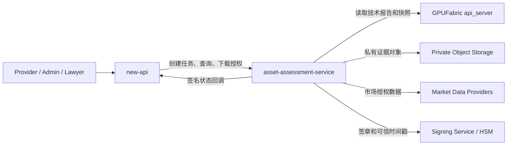
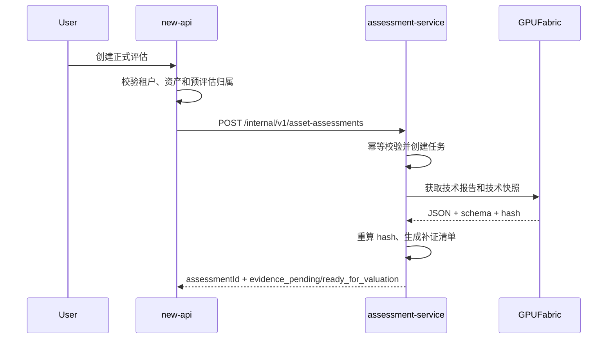
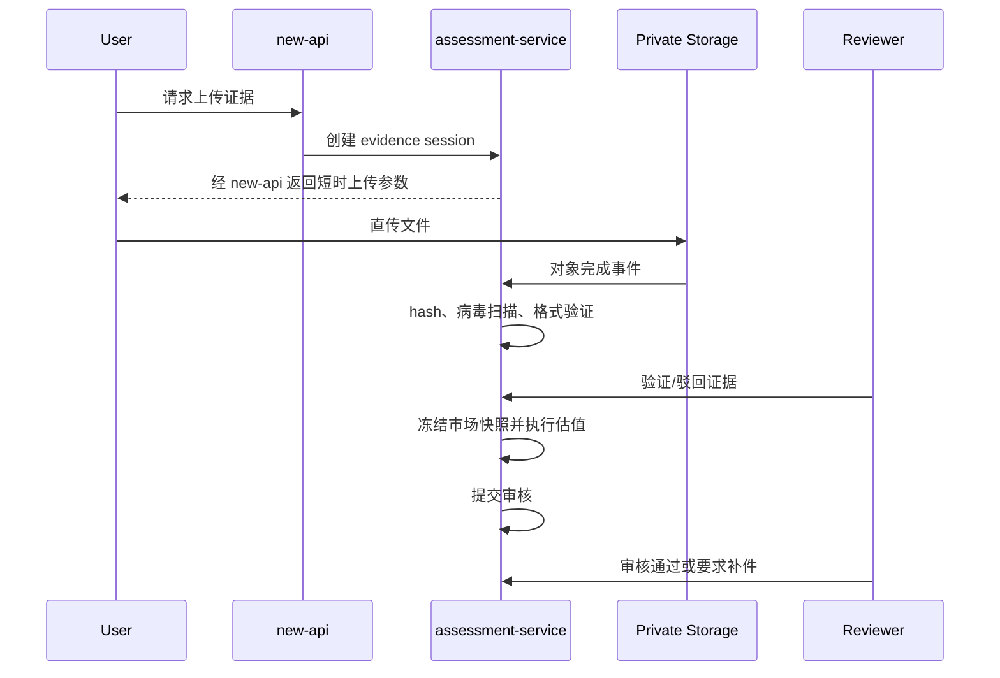
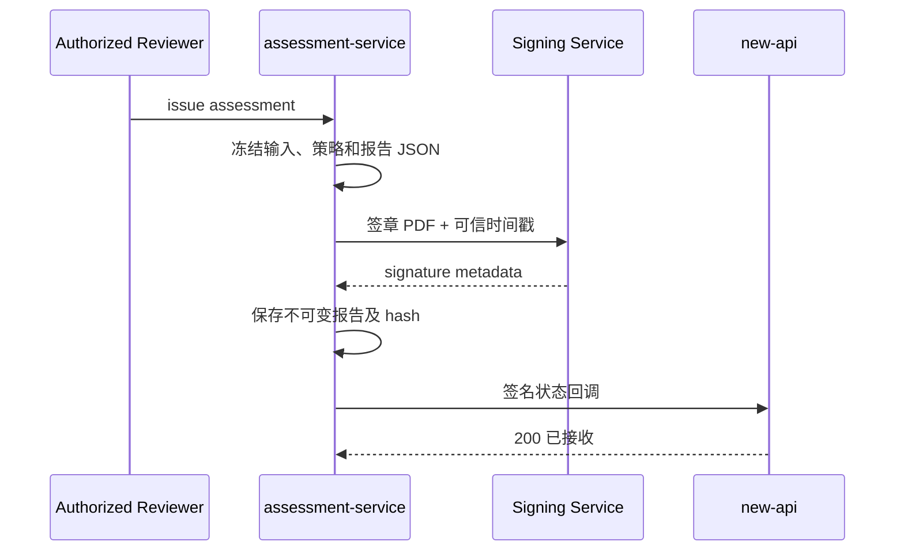

# asset-assessment-service 对接与开发规范

> 文档状态：开发联调基线
> 版本：v1.1
> 日期：2026-07-17
> 适用服务：`asset-assessment-service`、`new-api`、GPUFabric `api_server`
> 上游设计：`2026-07-14-compute-banking-integration-design.md`

## 1. 文档目标

本文定义私有评估域 `asset-assessment-service` 的业务职责、数据边界、接口协议、状态机、安全要求和联调验收标准，用于指导：

- `new-api` 创建、查询和编排正式评估任务。
- `asset-assessment-service` 获取 GPUFabric 技术底稿并完成证据、定价、审核和签发。
- GPUFabric 向评估服务提供不可变技术快照和技术预评估报告。
- 三个服务在不泄露用户隐私、权属材料、市场授权数据和风控规则的前提下完成闭环。

本文中的“必须”“不得”属于生产环境强制要求；“建议”允许在设计评审后调整。

## 2. 业务定位

### 2.1 服务定位

`asset-assessment-service` 是算力银行的私有评估执行域，负责：

1. 接收 new-api 创建的正式评估任务。
2. 获取并验证 GPUFabric 技术快照和技术预评估报告。
3. 生成补证清单并管理私有证据。
4. 验证权属、生命周期、性能、运营和市场证据。
5. 聚合市场样本并冻结市场价格快照。
6. 执行版本化定价策略，产出可复算估值结果。
7. 支持人工审核、驳回、补件和重新提交。
8. 冻结、签发、撤销正式资产评估报告。
9. 通过签名回调向 new-api 同步最小业务状态。
10. 提供受控的短时报告下载授权。

### 2.2 不属于本服务的职责

以下能力不得放入 `asset-assessment-service`：

- 用户登录、用户角色和前端会话管理。
- Provider、Lawyer、Bank、Admin 的门户路由和菜单权限。
- 用户与 GPUFabric `client_id` 的公开业务绑定。
- 交易挂牌、订单、支付、贷款审批和放款状态机。
- GPU 设备探针采集和在线监控。
- 用户通知、站内信和用户可见任务列表。
- 银行最终授信决策和放款承诺。

这些能力分别属于 new-api、GPUFabric 或银行业务系统。

### 2.3 三服务边界

| 服务 | 权威数据 | 可以保存 | 不得保存 |
|---|---|---|---|
| GPUFabric | 硬件采集、遥测、基准证据、技术快照、技术预评估 | 设备技术字段、来源、质量和不可变 hash | 发票、合同、实名材料、银行审批、正式定价规则 |
| new-api | 用户、租户、角色、资产绑定、业务任务、交易和贷款流程 | 任务状态、报告摘要、报告引用、回调事件、下载审计 | 原始权属材料、市场原始样本、评估规则、签章私钥 |
| asset-assessment-service | 私有证据、市场样本、定价策略、审核、正式报告 | 评估所需私有数据和不可变结果 | 用户密码、浏览器会话、GPUFabric 设备 Token、银行放款凭证 |

### 2.4 部署决策

- 生产环境必须独立部署 `asset-assessment-service`，使用独立数据库账号和私有对象存储空间。
- 服务可以与 new-api 部署在同一机器，但必须使用独立进程、容器、数据库 schema/实例和服务身份。
- 总体设计中的“未配置 `ASSESSMENT_SERVICE_URL` 时由 new-api 内置最小评估”仅允许本地演示。
- 内置最小评估不得生成正式估值、授信参考、签章 PDF 或 `issued` 状态报告。
- 生产环境未配置评估服务时，new-api 应返回 `ASSESSMENT_SERVICE_UNAVAILABLE`，不得静默降级。

## 3. 业务报告分级

| 层级 | 生成方 | 主要依据 | 可用于 | 不可用于 |
|---|---|---|---|---|
| T0 技术预评估 | GPUFabric | 探针、规格目录、可用基准 | 快速筛选、交易展示、补证提示 | 正式估值、正式授信 |
| T1 定价预评估 | asset-assessment-service | T0 + 市场快照 + 基础生命周期证据 | 交易定价、融资预审参考 | 最终授信承诺 |
| T2 正式资产评估 | asset-assessment-service | T1 + 权属 + 审核 + 签章 | 正式评估、贷款材料、资产留档 | 替代银行最终审批 |

请求中的 `requestedTier` 仅允许：

```text
T1
T2
```

T2 可以在创建后因证据不足停留在 `evidence_pending`，不得自动降级为 T1 后伪装成正式报告。

## 4. 集成参与方



浏览器不得直接调用评估服务的任务管理、审核、签发和撤销接口。证据文件可以使用评估服务签发的短时 URL 直传私有对象存储。

## 5. 跨系统标识

### 5.1 标识定义

| 字段 | 生成方 | 用途 | 是否可对用户展示 |
|---|---|---|---|
| `clientRequestId` | new-api | 租户范围业务幂等 | 否 |
| `correlationId` | new-api | 跨服务链路追踪 | 否 |
| `tenantRef` | new-api | 脱敏租户引用 | 否 |
| `userRef` | new-api | 脱敏用户引用 | 否 |
| `assetRef` | new-api | 业务资产引用 | 是，可使用业务编号 |
| `assessmentId` | assessment-service | 正式评估主键 | 是 |
| `technicalReportId` | GPUFabric | 技术预评估引用 | 是 |
| `technicalSnapshotId` | GPUFabric | 不可变技术快照引用 | 否或受控展示 |
| `evidenceId` | assessment-service | 私有证据引用 | 否 |
| `marketSnapshotId` | assessment-service | 市场聚合快照引用 | 否 |
| `valuationId` | assessment-service | 估值结果引用 | 否 |
| `reportId` | assessment-service | 正式报告编号 | 是 |
| `eventId` | assessment-service | 回调去重 | 否 |

### 5.2 标识规则

- `assessmentId`、`evidenceId` 等内部主键使用 UUIDv7 或同等不可预测标识。
- 用户可见的 `reportId` 建议采用 `AER-YYYY-MM-序号`，但数据库唯一性不得依赖短序号。
- `tenantRef` 和 `userRef` 必须是不可逆或密钥化引用，不得传递 new-api 原始用户 ID、邮箱或手机号。
- `clientRequestId` 的唯一范围为“调用服务主体 + `tenantRef`”。
- `assetRef` 由 new-api 管理，评估服务不得根据该字段直接推导 GPUFabric `client_id`。
- GPUFabric 技术引用必须同时保存 ID、schema version 和 SHA-256。

## 6. 服务间认证与通用协议

### 6.1 传输安全

- 生产环境必须使用 TLS。
- 推荐 new-api、assessment-service、GPUFabric 之间使用 mTLS。
- 如使用 OAuth2 client credentials，Token 必须包含明确 audience 和 service scope。
- 禁止仅依赖源 IP 白名单完成身份认证。

### 6.2 请求头

```http
Authorization: Bearer <service-token>
Content-Type: application/json
X-Request-ID: req_01...
X-Correlation-ID: corr_01...
Idempotency-Key: as_01...
```

写接口必须携带 `X-Request-ID`。创建、估值、提交审核、签发、撤销和下载授权必须携带 `Idempotency-Key`。

### 6.3 服务 scope

建议至少划分：

```text
assessment:create
assessment:read
assessment:evidence
assessment:evidence:complete
assessment:evidence:scan
assessment:review
assessment:issue
assessment:revoke
assessment:download
technical-snapshot:read
technical-report:read
```

new-api 不应拥有 `assessment:issue`、`assessment:revoke` 或评估规则修改权限。签发与撤销只能由评估服务内部审核身份调用。

### 6.4 通用成功响应

```json
{
  "success": true,
  "data": {},
  "requestId": "req_01..."
}
```

### 6.5 通用错误响应

```json
{
  "success": false,
  "error": {
    "code": "ASSESSMENT_NOT_FOUND",
    "message": "assessment does not exist",
    "retryable": false,
    "details": {}
  },
  "requestId": "req_01..."
}
```

错误响应不得返回数据库 SQL、对象存储真实路径、策略源码、密钥标识或审核人员隐私信息。

## 7. 核心业务流程

### 7.1 从技术预评估创建正式评估



### 7.2 补证、估值和审核



### 7.3 签发和回调



## 8. new-api 调用接口

### 8.1 创建评估

```http
POST /internal/v1/asset-assessments
```

请求：

```json
{
  "clientRequestId": "as_01J0FORMAL001",
  "correlationId": "corr_01J0...",
  "tenantRef": "tenant_hmac_v1_...",
  "userRef": "user_hmac_v1_...",
  "assetRef": "asset_01J0GPU001",
  "requestedTier": "T1",
  "purpose": ["trading", "financing_pre_review"],
  "preEvaluation": {
    "provider": "gpufabric",
    "reportId": "PRE-2026-07-...",
    "reportSha256": "64-hex",
    "reportHtmlSha256": "64-hex",
    "schemaVersion": "gpuf.pre_evaluation.v1",
    "technicalSnapshotId": "TAS-2026-07-...",
    "technicalSnapshotSha256": "64-hex",
    "technicalSnapshotSchemaVersion": "technical_asset_snapshot.v2"
  },
  "callback": {
    "urlRef": "new-api-primary",
    "eventTypes": [
      "asset_assessment.status_changed",
      "asset_assessment.issued",
      "asset_assessment.revoked"
    ]
  }
}
```

约束：

- `tenantRef`、`assetRef`、`requestedTier`、`preEvaluation.reportId` 和 `reportSha256` 必填。
- `purpose` 只影响报告用途声明，不得直接改变估值结果。
- `callback.urlRef` 使用服务端预配置引用，不接受任意 URL，避免 SSRF。
- `reportHtmlSha256` 为可选兼容字段；提供后必须验证冻结 HTML 字节与响应头 Hash。技术快照引用同样可选，提供后必须完成 v2 Hash 验证。

响应 HTTP `202`：

```json
{
  "success": true,
  "data": {
    "assessmentId": "ASMT-2026-07-...",
    "status": "evidence_pending",
    "requestedTier": "T1",
    "requiredEvidence": [
      {
        "code": "ownership.invoice",
        "required": true,
        "reason": "OWNERSHIP_NOT_VERIFIED"
      },
      {
        "code": "asset.lifecycle",
        "required": true,
        "reason": "DEVICE_AGE_UNKNOWN"
      },
      {
        "code": "market.configuration",
        "required": false,
        "reason": "MARKET_MATCH_LOW_CONFIDENCE"
      }
    ],
    "technicalVerification": {
      "status": "verified",
      "reportId": "PRE-2026-07-...",
      "snapshotId": "TAS-2026-07-..."
    },
    "createdAt": "2026-07-15T00:00:00Z"
  },
  "requestId": "req_01..."
}
```

### 8.2 查询评估

```http
GET /internal/v1/asset-assessments/{assessmentId}
```

响应：

```json
{
  "success": true,
  "data": {
    "assessmentId": "ASMT-2026-07-...",
    "assetRef": "asset_01J0GPU001",
    "requestedTier": "T1",
    "status": "evidence_pending",
    "progress": 25,
    "technicalVerificationStatus": "verified",
    "evidenceSummary": {
      "required": 3,
      "uploaded": 1,
      "verified": 1,
      "rejected": 0
    },
    "valuationSummary": null,
    "reportSummary": null,
    "missingEvidence": ["asset.lifecycle"],
    "nextActions": ["UPLOAD_ASSET_LIFECYCLE_EVIDENCE"],
    "createdAt": "2026-07-15T00:00:00Z",
    "updatedAt": "2026-07-15T00:05:00Z"
  }
}
```

该接口不得返回：原始证据 URL、市场样本明细、完整审核意见、策略配置和签章内部元数据。

### 8.3 获取补证清单

```http
GET /internal/v1/asset-assessments/{assessmentId}/evidence-requirements
```

响应中的每个要求必须包含稳定的 `code`、是否必需、当前状态、允许文件类型、最大文件大小和缺失原因。

### 8.4 创建证据上传会话

```http
POST /internal/v1/asset-assessments/{assessmentId}/evidence-sessions
```

请求：

```json
{
  "clientRequestId": "evs_01...",
  "evidenceType": "ownership.invoice",
  "contentType": "application/pdf",
  "contentLength": 123456,
  "fileName": "invoice.pdf",
  "sha256": "optional-64-hex"
}
```

响应：

```json
{
  "success": true,
  "data": {
    "evidenceId": "EVD-...",
    "uploadMethod": "PUT",
    "uploadUrl": "https://private-object-storage/...",
    "expiresAt": "2026-07-15T00:10:00Z",
    "requiredHeaders": {
      "Content-Type": "application/pdf"
    },
    "maximumBytes": 10485760
  }
}
```

new-api 不得持久化完整上传 URL，也不得将 URL 查询参数写入日志。

### 8.5 申请报告下载

```http
POST /internal/v1/asset-assessments/{assessmentId}/report-downloads
```

请求：

```json
{
  "clientRequestId": "dl_01...",
  "requesterRef": "user_hmac_v1_...",
  "purpose": "user_download",
  "expiresInSeconds": 120
}
```

响应：

```json
{
  "success": true,
  "data": {
    "reportId": "AER-2026-07-...",
    "downloadUrl": "https://private-object-storage/...",
    "expiresAt": "2026-07-15T00:02:00Z",
    "sha256": "64-hex",
    "contentType": "application/pdf"
  }
}
```

仅 `issued` 且未撤销、未过期的报告可以生成下载授权。

## 9. GPUFabric 对接接口

### 9.1 目标接口

评估服务使用独立服务身份调用：

```text
GET /internal/v1/technical-pre-evaluations/{reportId}
GET /api/banking/provider/pre-evaluations/{reportId}/html
GET /internal/v2/technical-snapshots/{snapshotId}
```

兼容阶段允许读取当前 GPUFabric v1 预评估查询接口，但适配器内部必须统一转换为固定 DTO。

### 9.2 技术底稿验证

评估服务必须：

1. 校验 GPUFabric 服务身份和 TLS 证书。
2. 校验响应中的 schema version。
3. 对返回的 JSON 原始字节重新计算 SHA-256。
4. 若提供 `reportHtmlSha256`，下载冻结 HTML，并同时校验响应字节和 `X-Content-SHA256`。
5. 比对调用方提供的 JSON、HTML、v2 Hash 和 GPUFabric 返回内容。
6. 保存获取时间、技术引用、schema、hash、验证结果和服务身份。
7. 将技术输入冻结为 assessment 的不可变引用。

任何 hash 不一致均进入 `technical_rejected`，不得继续估值。

### 9.3 可保存与不可保存字段

可保存：

- GPU 型号、数量、显存、互联、驱动和固件版本。
- 规范化性能指标、质量等级、字段来源和缺失码。
- 技术快照 ID、报告 ID、schema version、JSON/HTML/v2 hash。

不得保存：

- GPUFabric 用户 Token、设备私钥或 challenge secret。
- 原始主机名、公网 IP、MAC、完整序列号。
- 与评估无关的进程、文件路径和环境变量。

如确需设备唯一性验证，只保存私有加盐后的 `assetIdentityHash`，盐由评估服务密钥系统管理。

## 10. 私有证据模型

### 10.1 支持的证据类型

```text
ownership.invoice
ownership.contract
ownership.payment
ownership.inventory
ownership.registry
asset.lifecycle
asset.warranty
asset.maintenance
asset.location
benchmark.signed_result
economics.billing
economics.energy
economics.hosting
market.configuration
```

### 10.2 证据状态

```text
pending_upload
uploaded
scanning
pending_review
verified
rejected
expired
deleted
```

### 10.3 证据记录

```text
evidence_id
assessment_id
evidence_type
holder_ref
asset_identity_hash
document_object_ref
document_sha256
content_type
content_length
issuer_ref
issued_at
verification_status
verification_code
verified_by
verified_at
rejection_code
retention_policy
created_at
```

原始对象只能位于私有 bucket。数据库保存对象引用，不保存公网 URL。

### 10.4 文件安全

- 上传前限制 content type、扩展名和大小。
- 上传后重新检测真实文件类型，不信任浏览器声明。
- 必须执行恶意文件扫描。
- PDF、图片解析在隔离进程或沙箱中完成。
- Office 文档默认拒绝宏，必要时转换为安全 PDF。
- 下载时强制 `Content-Disposition: attachment`。
- 删除与保留策略必须可审计。

## 11. 市场数据与估值

### 11.1 MarketObservation

每条市场样本至少包含：

```text
observation_id
provider_id
license_policy_id
source_type
captured_at
region
currency
asset_configuration
condition
asking_price_minor
transaction_price_minor
tax_included
shipping_included
source_quality
deduplication_key
raw_object_ref
```

原始市场数据只允许评估服务内部访问；new-api 只接收聚合摘要。

### 11.2 MarketPriceSnapshot

市场快照必须不可变，并包含：

```text
market_snapshot_id
asset_configuration_digest
region
currency
sample_count
provider_count
low_price_minor
median_price_minor
high_price_minor
liquidity_score
confidence
observation_cutoff_at
aggregation_policy_version
snapshot_sha256
created_at
```

### 11.3 PricingPolicy

定价策略必须版本化并经过审批：

```text
policy_id
policy_version
status
effective_from
effective_until
supported_regions
supported_asset_classes
algorithm_digest
market_aggregation_version
depreciation_curve_version
condition_adjustments
warranty_adjustments
liquidity_adjustments
minimum_confidence
approved_by
approved_at
```

生产估值不得使用 `FP16 × 参考单价` 作为唯一算法。

### 11.4 ValuationResult

```text
valuation_id
assessment_id
technical_snapshot_id
market_snapshot_id
policy_id
method
cost_value_minor
market_value_minor
income_value_minor
point_value_minor
low_value_minor
high_value_minor
currency
confidence
adjustment_factors
missing_evidence
calculated_at
valuation_sha256
```

同一组冻结输入、策略版本和算法 digest 必须能够得到相同结果。

### 11.5 执行估值

```http
POST /internal/v1/asset-assessments/{assessmentId}/valuation
```

该接口只允许评估服务内部工作流或授权后台调用，不对 new-api 普通服务身份开放。

请求：

```json
{
  "clientRequestId": "val_01...",
  "policyVersion": "gpu-valuation-2026.07",
  "marketCutoffAt": "2026-07-15T00:00:00Z",
  "currency": "CNY"
}
```

市场样本不足时返回可解释结果，不得编造估值：

```json
{
  "success": false,
  "error": {
    "code": "MARKET_DATA_INSUFFICIENT",
    "message": "insufficient comparable observations",
    "retryable": false,
    "details": {
      "sampleCount": 1,
      "minimumRequired": 3,
      "missing": ["COMPARABLE_TRANSACTION_PRICE"]
    }
  }
}
```

## 12. 评估状态机

### 12.1 状态定义

```text
created
technical_fetching
technical_verified
technical_rejected
evidence_pending
evidence_reviewing
ready_for_valuation
valuating
valuation_ready
review_pending
reviewing
changes_requested
approved
issuing
issued
rejected
revoked
expired
failed
```

### 12.2 合法转换

```text
created -> technical_fetching
technical_fetching -> technical_verified | technical_rejected | failed
technical_verified -> evidence_pending | ready_for_valuation
evidence_pending -> evidence_reviewing
evidence_reviewing -> evidence_pending | ready_for_valuation | rejected
ready_for_valuation -> valuating
valuating -> valuation_ready | evidence_pending | failed
valuation_ready -> review_pending
review_pending -> reviewing
reviewing -> approved | changes_requested | rejected
changes_requested -> evidence_pending | ready_for_valuation
approved -> issuing
issuing -> issued | failed
issued -> revoked | expired
failed -> technical_fetching | evidence_pending | ready_for_valuation
```

不得从 `rejected`、`revoked` 或 `expired` 恢复。重新评估必须创建新的 `assessmentId` 并关联原任务。

### 12.3 状态接口

提交审核：

```http
POST /internal/v1/asset-assessments/{assessmentId}/submit-review
```

审核动作：

```http
POST /internal/v1/asset-assessments/{assessmentId}/review-actions
```

```json
{
  "clientRequestId": "review_01...",
  "action": "approve",
  "reasonCode": "ALL_REQUIREMENTS_SATISFIED",
  "opinion": "private reviewer opinion"
}
```

`action` 允许：`start_review`、`approve`、`request_changes`、`reject`。完整 `opinion` 只保存在评估服务，不通过回调发送。

## 13. 报告冻结、签发和撤销

### 13.1 签发前冻结清单

签发前必须冻结并记录 hash：

- 技术预评估和技术快照引用。
- 已验证证据清单及各证据 hash。
- 市场价格快照。
- 定价策略版本和算法 digest。
- 估值结果。
- 审核决定和授权审核身份。
- 报告 JSON 和待签 PDF。

### 13.2 签发接口

```http
POST /internal/v1/asset-assessments/{assessmentId}/issue
```

```json
{
  "clientRequestId": "issue_01...",
  "validityDays": 180,
  "issuerRef": "assessment-center-v1",
  "signatureProfile": "commercial-seal-v1"
}
```

签发要求：

- 当前状态必须为 `approved`。
- 策略、市场快照和证据均未失效。
- 签发者具有独立授权，不得由 new-api 用户身份直接触发。
- 签章服务失败时保持 `failed` 或可重试的 `issuing`，不得生成未签名的正式报告。

### 13.3 报告摘要

new-api 可见摘要：

```json
{
  "reportId": "AER-2026-07-...",
  "reportStatus": "issued",
  "assessmentTier": "T2",
  "currency": "CNY",
  "pointValueMinor": 25200000,
  "lowValueMinor": 23100000,
  "highValueMinor": 26800000,
  "confidence": 0.84,
  "riskLevel": "low",
  "creditReferenceMinor": 16400000,
  "issuedAt": "2026-07-15T00:00:00Z",
  "validUntil": "2027-01-11T00:00:00Z",
  "reportSha256": "64-hex",
  "downloadAvailable": true
}
```

`creditReferenceMinor` 仅为评估参考，必须在报告中声明“不构成银行授信承诺”。

### 13.4 撤销接口

```http
POST /internal/v1/asset-assessments/{assessmentId}/revoke
```

```json
{
  "clientRequestId": "revoke_01...",
  "reasonCode": "EVIDENCE_FRAUD_CONFIRMED",
  "reason": "private revocation detail"
}
```

撤销后：

- 立即停止签发新的下载授权。
- 已签发短时 URL 不得超过最大 120 秒有效期。
- 向 new-api 发送 `asset_assessment.revoked` 回调。
- 保留原报告、撤销时间、原因码和审计记录，不得物理覆盖。

## 14. 回调 new-api

### 14.1 回调接口

```http
POST /api/banking/callback/assessment
X-Event-ID: evt_01...
X-Event-Timestamp: 1784000000
X-Event-Signature: v1=<signature>
```

如 new-api 最终采用内部路由，也可以部署为：

```text
POST /internal/callbacks/asset-assessments
```

生产前必须冻结一个唯一地址，不允许同时长期维护两套路径。

### 14.2 状态回调

```json
{
  "eventId": "evt_01J0...",
  "eventType": "asset_assessment.status_changed",
  "schemaVersion": "asset_assessment_event.v1",
  "occurredAt": "2026-07-15T00:00:00Z",
  "correlationId": "corr_01J0...",
  "assessmentId": "ASMT-2026-07-...",
  "clientRequestId": "as_01J0FORMAL001",
  "assetRef": "asset_01J0GPU001",
  "status": "evidence_pending",
  "progress": 25,
  "requiredEvidenceCodes": ["asset.lifecycle"],
  "report": null,
  "error": null
}
```

### 14.3 签发回调

```json
{
  "eventId": "evt_01J0...",
  "eventType": "asset_assessment.issued",
  "schemaVersion": "asset_assessment_event.v1",
  "occurredAt": "2026-07-15T00:00:00Z",
  "correlationId": "corr_01J0...",
  "assessmentId": "ASMT-2026-07-...",
  "clientRequestId": "as_01J0FORMAL001",
  "assetRef": "asset_01J0GPU001",
  "status": "issued",
  "progress": 100,
  "requiredEvidenceCodes": [],
  "report": {
    "reportId": "AER-2026-07-...",
    "reportSha256": "64-hex",
    "reportStatus": "issued",
    "issuedAt": "2026-07-15T00:00:00Z",
    "validUntil": "2027-01-11T00:00:00Z",
    "downloadAvailable": true
  },
  "error": null
}
```

### 14.4 签名与重试

- 回调使用 mTLS 加 Ed25519/JWS 签名，或 HMAC-SHA256 作为第一阶段兼容方案。
- 签名覆盖 HTTP method、path、event ID、timestamp 和原始 body hash。
- new-api 允许的时间偏差建议为 5 分钟。
- assessment-service 使用 Outbox 表确保业务状态和事件在同一事务提交。
- 重试间隔建议：10 秒、30 秒、2 分钟、10 分钟、1 小时。
- 达到最大次数后进入死信队列并触发运营告警。
- new-api 按 `eventId` 去重；重复事件返回 HTTP `200`。

回调不得包含原始证据地址、市场样本、完整审核意见、规则配置、签章私钥或 HSM key handle。

## 15. 数据库建议

### 15.1 核心表

```text
asset_assessments
assessment_technical_inputs
assessment_evidence_requirements
assessment_evidence
benchmark_evidence
market_observations
market_price_snapshots
pricing_policies
valuation_results
assessment_reviews
assessment_reports
assessment_report_versions
assessment_events_outbox
assessment_callback_deliveries
assessment_audit_logs
idempotency_records
```

### 15.2 主表关键字段

```text
assessment_id
tenant_ref
user_ref
asset_ref
client_request_id
request_digest
correlation_id
requested_tier
purpose
status
progress
technical_report_id
technical_report_sha256
technical_snapshot_id
technical_snapshot_sha256
active_valuation_id
active_report_id
created_at
updated_at
```

唯一约束：

```text
unique(service_subject, tenant_ref, client_request_id)
unique(report_id)
unique(event_id)
```

### 15.3 数据库隔离

- assessment-service 使用独立 PostgreSQL 数据库或至少独立 schema 和账号。
- new-api 的 `banking_assessment_tasks` 只保存任务镜像，不与评估服务共享表。
- 禁止 new-api 直接连接评估服务数据库。
- 禁止 assessment-service 直接连接 new-api 主库或 GPUFabric 数据库。
- 所有跨域读取必须通过受认证 API 或事件完成。

## 16. 幂等、并发和一致性

### 16.1 创建幂等

- 幂等键：`serviceSubject + tenantRef + clientRequestId`。
- 首次请求保存规范化请求摘要 `requestDigest`。
- 同键同摘要返回原 `assessmentId` 和当前状态。
- 同键不同摘要返回 HTTP `409 IDEMPOTENCY_CONFLICT`。

### 16.2 动作幂等

以下操作必须幂等：

- 创建评估。
- 创建上传会话。
- 执行估值。
- 提交审核。
- 审核动作。
- 签发。
- 撤销。
- 创建下载授权。

### 16.3 乐观锁

主评估记录建议使用 `version` 字段。状态更新采用：

```text
UPDATE ... WHERE assessment_id = ? AND version = ? AND status = ?
```

并发冲突返回 `409 STATE_VERSION_CONFLICT`，调用方重新读取状态后决定是否重试。

### 16.4 不可变结果

- 技术输入、市场快照、估值结果、报告版本签发后不可覆盖。
- 修正必须创建新版本并保留前一版本引用。
- 审计日志只追加，不允许更新和删除。

## 17. 错误码

### 17.1 通用错误

| HTTP | 错误码 | 含义 | 可重试 |
|---|---|---|---|
| 400 | `INVALID_ARGUMENT` | 参数无效 | 否 |
| 401 | `SERVICE_UNAUTHENTICATED` | 服务身份无效 | 否 |
| 403 | `SERVICE_SCOPE_DENIED` | scope 不足 | 否 |
| 404 | `ASSESSMENT_NOT_FOUND` | 任务不存在或不可见 | 否 |
| 409 | `IDEMPOTENCY_CONFLICT` | 幂等键请求内容冲突 | 否 |
| 409 | `INVALID_STATE_TRANSITION` | 非法状态转换 | 否 |
| 409 | `STATE_VERSION_CONFLICT` | 并发版本冲突 | 是 |
| 429 | `RATE_LIMITED` | 服务限流 | 是 |
| 503 | `DEPENDENCY_UNAVAILABLE` | 上游暂不可用 | 是 |

### 17.2 技术底稿错误

```text
TECHNICAL_REPORT_NOT_FOUND
TECHNICAL_SNAPSHOT_NOT_FOUND
TECHNICAL_SCHEMA_UNSUPPORTED
TECHNICAL_HASH_MISMATCH
TECHNICAL_REPORT_EXPIRED
GPUFABRIC_UNAVAILABLE
```

### 17.3 证据与估值错误

```text
EVIDENCE_REQUIRED
EVIDENCE_TYPE_UNSUPPORTED
EVIDENCE_TOO_LARGE
EVIDENCE_HASH_MISMATCH
EVIDENCE_MALWARE_DETECTED
EVIDENCE_REJECTED
MARKET_DATA_INSUFFICIENT
PRICING_POLICY_NOT_FOUND
PRICING_POLICY_NOT_APPROVED
VALUATION_REPRODUCIBILITY_FAILED
```

### 17.4 签发与下载错误

```text
ASSESSMENT_NOT_APPROVED
SIGNING_SERVICE_UNAVAILABLE
REPORT_NOT_ISSUED
REPORT_REVOKED
REPORT_EXPIRED
DOWNLOAD_NOT_AUTHORIZED
```

## 18. 隐私与安全要求

### 18.1 数据最小化

- new-api 传递脱敏引用，不传个人身份明文。
- GPUFabric 只提供评估必要的规范化技术字段。
- 回调只传状态、进度、缺失码和报告摘要。
- 日志不得记录请求完整 body、上传 URL、文件内容或市场样本。

### 18.2 加密

- 数据库、对象存储和备份必须静态加密。
- 高敏字段可使用字段级 envelope encryption。
- 服务密钥进入 Secret Manager，不得写入仓库、镜像和数据库配置表。
- 签章私钥只允许存在于 HSM 或签章服务，不进入应用内存和日志。

### 18.3 租户隔离

- 每次读写都以认证服务身份和 `tenantRef` 共同限定。
- 查询不存在和跨租户资源统一返回 `404`，避免资源枚举。
- 后台审核人员访问必须使用独立身份、最小权限和完整审计。
- 市场数据 provider 的授权范围必须在查询时强制执行。

### 18.4 审计

审计至少记录：

```text
audit_id
occurred_at
service_subject or operator_ref
operator_role
tenant_ref
assessment_id
action
from_status
to_status
request_id
correlation_id
reason_code
result
source_ip_hash
```

不得将完整身份证号、合同正文、上传 URL 和审核意见正文写入通用审计表。

## 19. 可观测性

### 19.1 指标

```text
assessment_create_total
assessment_status_transition_total
assessment_processing_duration_seconds
technical_fetch_duration_seconds
technical_hash_mismatch_total
evidence_upload_total
evidence_rejected_total
valuation_duration_seconds
valuation_failure_total
report_issue_duration_seconds
callback_delivery_total
callback_delivery_failure_total
```

标签不得包含用户 ID、文件名、报告全文 hash 之外的高基数字段。

### 19.2 日志字段

允许：

```text
request_id
correlation_id
assessment_id
tenant_ref_hash
operation
status
duration_ms
error_code
```

禁止：证据正文、对象 URL、用户身份明文、GPUFabric Token、市场样本正文和签章元数据密钥字段。

### 19.3 健康检查

```text
GET /healthz
GET /readyz
```

`readyz` 应检查数据库、Outbox worker 和必要密钥加载状态；GPUFabric、市场源或签章服务短暂不可用不应导致进程退出，但必须反映为依赖降级指标。

## 20. 配置项

```text
ASSESSMENT_HTTP_ADDR
ASSESSMENT_DATABASE_DSN
ASSESSMENT_PUBLIC_BASE_URL
ASSESSMENT_SERVICE_AUDIENCE
ASSESSMENT_NEW_API_CALLBACK_REF
ASSESSMENT_NEW_API_CALLBACK_URL
ASSESSMENT_CALLBACK_SIGNING_KEY_REF
ASSESSMENT_GPUFABRIC_URL
ASSESSMENT_GPUFABRIC_CLIENT_ID
ASSESSMENT_GPUFABRIC_CLIENT_SECRET_REF
ASSESSMENT_OBJECT_STORAGE_BUCKET
ASSESSMENT_OBJECT_STORAGE_KMS_KEY_REF
ASSESSMENT_MARKET_PROVIDER_CONFIG_REF
ASSESSMENT_SIGNING_SERVICE_URL
ASSESSMENT_SIGNING_KEY_PROFILE
ASSESSMENT_UPLOAD_MAX_BYTES
ASSESSMENT_DOWNLOAD_MAX_TTL_SECONDS
ASSESSMENT_EVIDENCE_RETENTION_POLICY
ASSESSMENT_LOG_LEVEL
```

示例环境文件只允许使用占位值，不得提交真实 DSN、Token、bucket 凭证和签章配置。

## 21. new-api 对接要求

new-api 需要实现：

1. `banking_assessment_tasks` 持久化评估任务镜像。
2. `ASSESSMENT_SERVICE_URL` 和服务身份配置。
3. 创建、查询、补证会话、报告下载客户端。
4. 回调验签、时间窗口校验和 `eventId` 去重。
5. assessment 状态到 banking 业务状态的显式映射。
6. 用户、租户、资产和报告下载权限校验。
7. OSS 仅用于 new-api 自有普通业务文件；正式评估原件和报告由评估服务私有存储管理。

new-api 不得：

- 直接调用签发、撤销和估值执行接口。
- 将 `pdf_url` 作为永久公开地址保存。
- 将正式报告 PDF 复制到公开 bucket。
- 在评估服务不可用时伪造成功结果。

## 22. GPUFabric 对接要求

GPUFabric 需要提供：

1. 稳定的技术预评估 v1 查询契约。
2. 不可变技术快照 v2 查询契约。
3. JSON 规范化和 SHA-256 计算规则。
4. schema version、生成时间、有效期、来源和质量字段。
5. 独立的 assessment-service 只读服务 scope。
6. 对过期、撤销或不存在报告使用稳定错误码。

GPUFabric 不接收和存储权属、市场、贷款、签发或审核数据。

## 23. 开发任务拆分

截至 2026-07-20，AS-001 至 AS-005、AS-007 至 AS-011 和 AS-013 已完成服务端代码与测试；AS-006 的 GPUFabric 证据验证侧已完成，生产 runner、密钥生命周期和评估策略接入仍受实际部署约束。

| ID | 优先级 | 任务 | 依赖 | 完成标准 |
|---|---|---|---|---|
| AS-001 | P0 | 创建 Go 服务骨架、模块边界和健康检查 | 无 | 可构建、可启动、health/ready 通过 |
| AS-002 | P0 | 建立 PostgreSQL 迁移、服务身份和审计框架 | AS-001 | 独立账号、迁移回滚和安全配置通过 |
| AS-003 | P0 | 实现 assessment 创建、查询、幂等和状态机 | AS-002 | 租户隔离和状态单测通过 |
| AS-004 | P0 | 实现 GPUFabric JSON/HTML/v2 客户端、DTO 适配和三 Hash 验证 | GF-001 | 旧客户端兼容、三 Hash 和错误处理通过 |
| AS-005 | P1 | 实现证据要求、上传会话、扫描和审核 | AS-003 | 私有存储、hash 和恶意文件测试通过 |
| AS-006 | P1 | [partial] 接入可信 benchmark 证据 | GPUFabric GF-015 | GPUFabric 证据校验已通过；生产 runner、密钥生命周期和评估策略待接入 |
| AS-007 | P1 | [server complete] 实现 MarketObservation 授权接入 | 数据授权 | 服务端去重、许可、质量和保留门禁已通过；真实供应商许可待接入 |
| AS-008 | P1 | [server complete] 实现不可变 MarketPriceSnapshot 聚合 | AS-007 | 样本、分位数、置信度可追溯；真实生产样本待回归 |
| AS-009 | P1 | [server complete] 实现 PricingPolicy 和 ValuationResult | AS-008 | 同输入同策略可复算；正式金额继续受市场许可和治理门禁约束 |
| AS-010 | P1 | [partial] 实现报告冻结、HTML/PDF、签发、撤销和下载 | AS-005/009 | JSON/HTML 默认关闭冻结和 hash 校验已完成；PDF、签发、撤销、下载和 HSM 仍待生产依赖 |
| AS-011 | P0 | 实现 Outbox、签名回调、重试和死信 | AS-003 | 回调不丢失且可去重 |
| AS-012 | P1 | 接入 Signing Service/HSM 和可信时间戳 | AS-010 | 证书链和签名可验证 |
| AS-013 | P1 | [partial] 实现审核后台 API、权限和审计 | AS-005/009 | 服务端双人顺序审核、职责分离和动作审计已完成；真实 Workbench 与人员身份联合认证待接入 |

首个可联调里程碑为 `AS-001` 至 `AS-004` 加 `AS-011`，不依赖市场数据和商用签章服务。

## 24. 联调顺序

### M1：任务骨架

- new-api 创建 assessment task。
- assessment-service 返回 `assessmentId`。
- 查询状态和创建幂等通过。
- assessment-service 使用 Stub GPUFabric DTO 完成状态迁移。

### M2：真实技术底稿

- assessment-service 读取 GPUFabric v1 技术预评估。
- 上线技术快照 v2 后切换到双引用。
- hash 一致、过期和篡改场景通过。
- 回调 new-api 并完成状态镜像。

### M3：私有证据

- 创建上传会话和浏览器直传。
- 完成事件、hash、扫描和人工验证通过。
- new-api 仅看到补证状态和规范化缺失码。

### M4：估值与报告

- 市场样本聚合和策略版本冻结。
- 估值可复算。
- 审核、签章、下载和撤销闭环通过。

## 25. 端到端验收场景

### E2E-AS-01 创建成功

- new-api 使用合法服务身份创建 T1 评估。
- assessment-service 验证 GPUFabric 报告 hash。
- 返回稳定 `assessmentId` 和补证清单。

### E2E-AS-02 创建幂等

- 相同 `clientRequestId` 和请求返回同一任务。
- 相同 key、不同请求返回 `409 IDEMPOTENCY_CONFLICT`。

### E2E-AS-03 跨租户访问

- 其他租户查询同一 `assessmentId` 返回 `404`。
- 审计记录拒绝事件但不泄露资源存在性。

### E2E-AS-04 技术报告篡改

- new-api 传入 hash 与 GPUFabric 内容不一致。
- 状态进入 `technical_rejected`，禁止估值和签发。

### E2E-AS-05 GPUFabric 不可用

- 返回可重试错误并保持任务可恢复。
- 不生成空技术报告或默认估值。

### E2E-AS-06 证据恶意文件

- 上传包含恶意内容的文件。
- 文件隔离，证据进入 `rejected`，不进入解析和审核流程。

### E2E-AS-07 市场数据不足

- 样本数低于策略阈值。
- 返回 `MARKET_DATA_INSUFFICIENT` 和缺失码，不编造价格。

### E2E-AS-08 非法状态转换

- 在 `evidence_pending` 状态调用 issue。
- 返回 `409 INVALID_STATE_TRANSITION`，状态和审计一致。

### E2E-AS-09 回调重放

- 相同 `eventId` 多次发送。
- new-api 只处理一次并始终返回成功确认。

### E2E-AS-10 签章失败

- 签章服务超时或证书不可用。
- 不产生 `issued` 报告；任务可安全重试。

### E2E-AS-11 报告撤销

- 撤销后 new-api 收到回调。
- 新下载授权失败，历史报告和撤销审计仍可追溯。

### E2E-AS-12 隐私日志检查

- 扫描应用日志、追踪和指标。
- 不出现用户身份明文、上传 URL、证据正文、市场样本和密钥。

## 26. Definition of Done

`asset-assessment-service` 第一阶段完成必须满足：

- OpenAPI 或等价接口定义与本文一致。
- 创建、查询、状态机、幂等和租户隔离测试通过。
- GPUFabric 技术报告适配和 hash 验证通过。
- Outbox 回调、验签、重试和死信场景通过。
- 数据库迁移支持升级和回滚。
- 配置示例不包含真实凭证。
- 日志和错误响应通过隐私检查。
- new-api 联调完成 E2E-AS-01 至 E2E-AS-05、E2E-AS-09。
- 生产配置关闭 new-api 内置评估降级。

完整正式评估上线还必须满足：

- 证据私有存储、扫描、审核和保留策略通过安全评审。
- 市场数据具有合法授权、去重和质量记录。
- 估值结果可复算，策略版本不可变。
- 签章、时间戳、报告撤销和下载审计通过。
- E2E-AS-06 至 E2E-AS-12 全部通过。

## 27. 开发前需要冻结的决策

1. new-api 回调最终使用 `/api/banking/callback/assessment` 还是 `/internal/callbacks/asset-assessments`。
2. 服务间认证采用 mTLS、OAuth2 client credentials，或二者同时使用。
3. GPUFabric v1 查询接口的正式内部路径和 canonical JSON 规则。
4. `assessmentId`、`reportId` 的编号格式和统一序号服务。
5. T1/T2 各自必需证据清单和失效周期。
6. 市场数据 provider、授权范围、最小样本数和地区口径。
7. 定价策略审批人和版本发布流程。
8. 报告签发主体、签章服务、证书链和可信时间戳供应商。
9. 私有证据和报告的保留、删除、法律留置政策。
10. new-api banking 状态与 assessment 状态的最终映射表。

## 28. 文档维护规则

- 接口字段变更必须更新示例、错误码、状态机和 E2E 场景。
- 不兼容变更必须发布新 API 或 schema version。
- 回调事件新增字段应保持向后兼容；删除或改变语义必须升级事件版本。
- 定价、市场和签章规则不得只记录在代码中，必须具有可审核的版本说明。
- 本文与跨服务总文档冲突时，应先更新架构决策，再同步两份文档。
