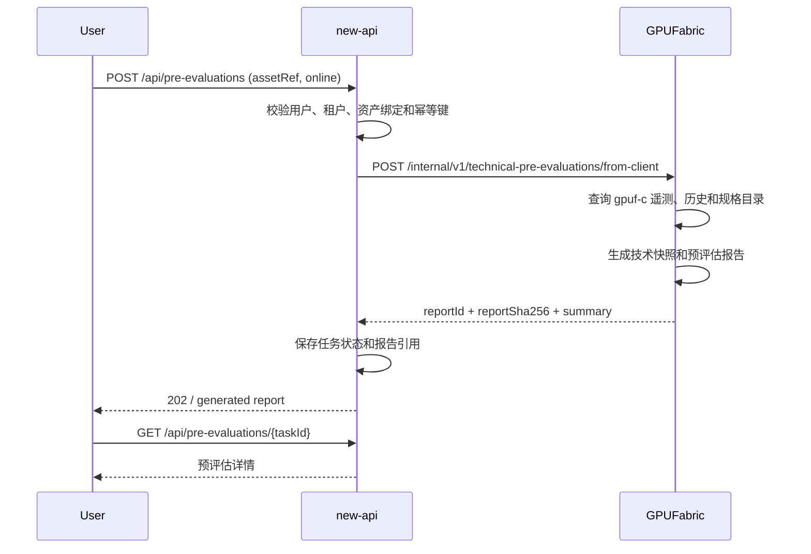
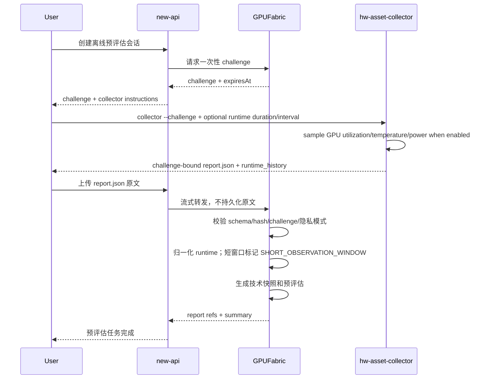
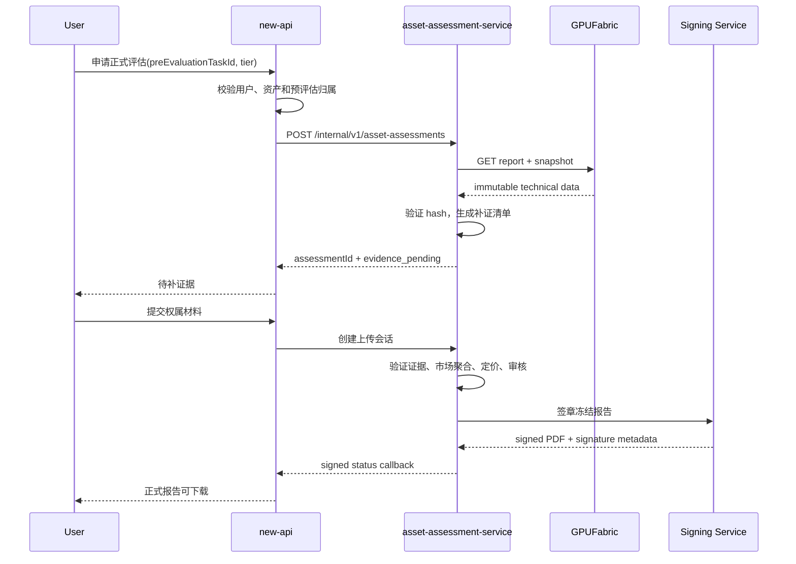

# 预评估与正式评估跨服务业务对接文档

状态：已实现联调基线
版本：v1.3
更新时间：2026-07-21
涉及仓库：GPUFabric、new-api、asset-assessment-service

## 1. 文档目标

本文档是三个仓库之间的业务和接口基线，用于拆分任务、冻结职责、支持并行开发和端到端验收。

本文档解决以下问题：

- 哪个服务负责预评估，哪个服务负责正式评估。
- 用户、资产、技术快照、预评估、市场估值和正式报告分别由谁保存。
- 在线设备和离线设备如何生成预评估报告。
- new-api 如何调用 GPUFabric，如何升级到正式评估。
- asset-assessment-service 如何读取技术底稿、补齐证据、定价、审核和签发。
- 三个仓库分别开发什么、依赖什么、如何验收。

本文档不定义具体市场数据供应商、银行授信政策、机构签章供应商和最终 UI 视觉稿。

## 2. 核心业务结论

### 2.1 两条业务路径

```text
快速预评估路径
用户 -> new-api -> GPUFabric -> 技术预评估报告 -> new-api -> 用户

正式评估路径
用户 -> new-api -> asset-assessment-service
     -> 获取 GPUFabric 预评估/技术快照
     -> 补齐确权、基准、市场和审核
     -> 签发正式报告
     -> 回调 new-api -> 用户
```

### 2.2 报告边界

| 报告 | 责任服务 | 是否自动 | 数据允许缺失 | 是否包含估值 | 是否签章 |
|---|---|---:|---:|---:|---:|
| 技术预评估报告 | GPUFabric | 是 | 是 | 默认否 | 否 |
| 定价预评估结果 | asset-assessment-service | 可自动 | 市场不足时不生成 | 是，区间值 | 否 |
| 正式资产评估报告 | asset-assessment-service + Signing Service | 否 | 关键证据不可缺失 | 是 | 是 |

### 2.3 “尽可能生成”的业务规则

GPUFabric 按以下优先级填充预评估报告：

1. 已验证实测基准。
2. 在线遥测和长期观测。
3. collector 探针采集库存。
4. 带来源和版本的 GPU 规格目录。
5. 没有可信来源的字段保持空值并列入缺失项。

GPUFabric 不得根据硬件算力直接猜测市场价格、质押率、贷款额或银行结论。

## 3. 当前代码基线

### 3.1 GPUFabric 当前能力

已实现：

- 在线 gpuf-c 数据生成预评估 JSON。
- 离线 collector challenge、SHA-256 校验和防重放。
- GPU 规格目录补全。
- 预评估报告不可变存储和读取时哈希校验。
- 原始离线证据默认不落库，可选 TTL 和手工清除。
- 管理 Token 鉴权和 Token 轮换。

当前接口：

```text
POST /internal/v1/technical-pre-evaluations/from-client
POST /internal/v1/technical-pre-evaluations/challenge
POST /internal/v1/technical-pre-evaluations/from-evidence
GET  /internal/v1/technical-pre-evaluations/{reportId}
GET  /internal/v2/technical-snapshots/{snapshotId}
GET  /api/banking/provider/pre-evaluations/{reportId}/html
DELETE /api/banking/provider/pre-evaluations/{reportId}/evidence
```

`/api/banking/provider/pre-evaluations/*` 创建路径继续作为兼容别名保留。

当前限制：

- v1 报告结构仍包含兼容的业务字段，但调用方业务补充结果会被拒绝。
- 技术快照 v2、逐字段来源、质量等级和冻结 HTML 已完成；GPUFabric 不生成正式 PDF。
- 已支持签名 BenchmarkEvidence 的登记和验证；离线 `offlineAssetRef` 使用固定 profile 映射为跨 challenge 稳定 `sourceRef`，collector `payloadSha256` 只承担单次证据完整性。远程 GPU 验收节点的 RTX 4070 SUPER 已通过真实 Ollama Runner 登记 LLM 与稳定性两项 Ed25519 证据，并自动关联到离线报告。
- 在线资产从 `device_daily_stats` 聚合最长 30 天运行历史；collector 现在可选用 `--runtime-duration-seconds`/`--runtime-interval-seconds` 采集 NVIDIA 利用率、温度、功耗、显存使用序列，并用 `--runtime-history-file` 跨进程保留 JSONL 历史。报告按保留窗口计算 `observationDays`，短于 7 天会保留 `SHORT_OBSERVATION_WINDOW`；离线历史始终保留 `SELF_REPORTED_RUNTIME_HISTORY`。GPUFabric 另按稳定 `sourceRef` 对不同自然日成功提交的、challenge 绑定且含新鲜运行样本的不可变快照去重，输出 `serverObservationDays`；只有这个服务端计数达到 7 天才获得长期观测加分。
- 市场数据属于私有评估域，不接入 GPUFabric。
- v1 创建接口返回的报告已经冻结并持久化，状态固定为 `generated`；过期由调用方根据 `validUntil` 投影为 `expired`。

### 3.2 new-api 当前能力

已具备：

- 用户认证、OwnerScope、在线/离线资产绑定和隔离的评估任务表。
- GPUFabric 在线/离线预评估客户端、报告/HTML Hash 校验和技术快照引用持久化。
- 离线 session 返回稳定 `benchmarkSourceRef`；new-api 用任务固定的 HMAC key 版本派生脱敏 `offlineAssetRef`，并在 challenge 与证据提交之间保持一致。
- assessment-service 创建/查询/材料要求/直传会话/报告下载客户端。
- 签名回调验签、事件去重、状态投影、幂等和下载审计。
- 显式 live staging 回归已通过在线预评估、T2 正式评估和 `asset.lifecycle` 材料要求。

当前限制：

- 本地 live 回归直接测试 new-api 服务层；浏览器会话仍需在真实 user-service、数据库迁移和 Provider 角色环境中验收。
- 在线/T2 已通过真实服务，远程 GPU 验收节点上的离线 collector 已通过一次性 challenge、runtime 采样、原始 JSON、new-api 服务层和 GPUFabric 的真实 staging 回归；同一回归通过受控 SSH 隧道访问节点上的 Ollama，自动关联两项签名 Benchmark。assessment-service 与 new-api 的回调密钥长度边界已统一并通过配置测试。真实材料上传、Outbox 到 new-api HTTP 回调接收和 issued 下载仍需联合 staging 回归。
- 生产仍必须使用 HTTPS/mTLS 或 OAuth2 服务身份；本机 HTTP 只允许显式测试开关。
- 旧 banking 兼容路由仍存在，发布时需确认弃用计划，避免前端继续接入旧资源名。

### 3.3 asset-assessment-service 当前能力

已实现：

- 独立 Go 服务、PostgreSQL 迁移、主体绑定服务凭证、租户隔离、幂等和 Outbox。
- 正式评估创建/查询以及 GPUFabric v1 JSON、冻结 HTML、技术快照 v2 三 Hash 校验。
- 私有证据需求、上传会话、上传完成、扫描、人工证据复核和 `ready_for_valuation` 状态门禁。
- 原生 S3/OSS 对象事件前缀解析和服务端 HEAD 核验、事务化事件收据、无对象键 Scanner/Reviewer 工作队列，以及最长 120 秒的状态绑定私有 GET 授权审计。
- 授权市场样本、独立核验、不可变市场快照、版本化估值策略和可复算估值结果。
- 策略作者/审批者职责分离、主审/复审双人治理，以及默认关闭的不可变 JSON/HTML 报告冻结层。

当前限制：

- 证据与报告存储已支持 HMAC gateway、原生 S3 SigV4 和阿里云 OSS V4；事件接收和 Scanner/Reviewer 服务端边界已完成。真实 bucket/KMS/最小权限、云事件源、隔离 Scanner/OCR 和 Reviewer Workbench 尚未完成生产验收。
- 正式金额仍受市场数据许可、生产样本治理和审核人员身份联合认证约束。
- PDF render、签发、撤销、过期、最长 120 秒下载授权及 Signing Service/X.509 验证边界已有默认关闭的服务端实现和本地回归；真实 renderer、私有存储、Signing Service/HSM、机构证书和可信时间戳未接入前，不能宣称生产正式报告已签发。

## 4. 服务职责

### 4.1 GPUFabric

负责：

- 验证在线客户端或离线 collector 来源。
- 规范化硬件、运行、规格和已验证基准。
- 生成技术快照和技术预评估报告。
- 保存快照、报告、哈希、缺失项和字段来源。
- 提供预评估读取和重新生成能力。

不负责：

- 用户登录、支付、订单和前端授权。
- 权属原件和客户身份材料。
- 市场数据、折旧、估值和质押率。
- 银行授信、正式审核和签章。

### 4.2 new-api

负责：

- 用户认证、租户隔离和资产归属校验。
- 将用户资产引用映射到 GPUFabric 在线客户端或离线采集任务。
- 创建预评估任务、展示状态和报告。
- 创建正式评估任务并展示进度。
- 接收正式评估回调和提供下载授权。
- 保存用户操作和下载审计。

不负责：

- 解析、修改或长期保存 collector 原始报告。
- 计算技术评分、市场估值和质押率。
- 保存私有定价策略、权属原件和签章私钥。

### 4.3 asset-assessment-service

负责：

- 接收正式评估申请。
- 获取并验证 GPUFabric 技术预评估和技术快照。
- 登记确权、生命周期、可信基准和市场数据。
- 生成市场价格快照、估值结果和置信度。
- 控制正式评估状态机、人工复核、签发和撤销。
- 调用 Signing Service / HSM。
- 向 new-api 发送最小化状态回调。

不负责：

- 用户支付、配额和浏览器会话。
- 直接读取 GPUFabric 或 new-api 数据库。
- 向设备发送任意脚本或命令。

## 5. 数据所有权

| 数据实体 | Source of Truth | new-api | GPUFabric | assessment-service |
|---|---|---|---|---|
| 用户、租户、订单、配额 | new-api | 完整 | 不保存 | 只保存受控引用 |
| 用户资产展示引用 | new-api | 完整 | 不保存 | 只保存受控引用 |
| gpuf client 与资产绑定 | new-api | 映射 | 技术 client 记录 | 不保存原始 client id |
| collector 原始证据 | GPUFabric 短时处理 | 不持久化 | 默认不保存原文，仅哈希 | 不复制原文 |
| 技术快照 | GPUFabric | ID + hash | 完整不可变快照 | ID + hash 或受控缓存 |
| 技术预评估报告 | GPUFabric | ID + hash + 展示缓存 | 完整不可变报告 | ID + hash |
| 权属材料 | assessment-service 私有存储 | ID + 状态 | 不保存 | 私有引用、hash、审核状态 |
| 市场原始观察 | assessment-service | 不保存 | 不保存 | 完整私有数据 |
| 市场价格快照 | assessment-service | 摘要可选 | 不保存 | 完整不可变快照 |
| 定价策略和估值结果 | assessment-service | ID + 摘要 | 不保存 | 完整版本化结果 |
| 正式报告 JSON/PDF | assessment-service | ID + hash + 下载引用 | 不保存 | 完整不可变报告 |
| 签章私钥 | Signing Service / HSM | 不保存 | 不保存 | 只保存密钥句柄 |

任何服务不得以数据库连接代替服务 API。

## 6. 跨系统标识

### 6.1 必需标识

| 标识 | 生成方 | 作用域 | 用途 |
|---|---|---|---|
| `tenantId` | new-api | 租户 | 数据隔离，不接受浏览器自行指定 |
| `userRef` | new-api | 租户 | 用户受控引用 |
| `assetRef` | new-api | 租户 | 用户看到的资产标识 |
| `clientRequestId` | new-api / 调用方 | 租户 + 操作 | 创建接口幂等 |
| `correlationId` | 首个入口服务 | 整条业务链 | 日志和事件关联 |
| `gpufClientRef` | new-api 内部映射 | 租户 | 映射 GPUFabric user/client，不返回浏览器 |
| `offlineAssetRef` | new-api | 用户 + 资产 + HMAC key 版本 | 服务间稳定脱敏引用，不接受浏览器指定 |
| `benchmarkSourceRef` | new-api/GPUFabric 固定 profile | 离线资产 | 64 位 Hash，供受控 runner 绑定签名 Benchmark |
| `technicalSnapshotId` | GPUFabric | 全局随机 | 技术快照引用 |
| `preEvaluationReportId` | GPUFabric | 全局随机 | 技术预评估引用 |
| `assessmentId` | assessment-service | 全局随机 | 正式评估任务引用 |
| `formalReportId` | assessment-service | 全局随机 | 正式报告引用 |
| `eventId` | 事件生产方 | 全局随机 | 回调和事件去重 |

### 6.2 标识规则

- 对外标识使用 UUID/ULID，不暴露数据库自增 ID。
- new-api 的查询必须包含 `tenantId + userRef + assetRef/taskId` 权限校验。
- 服务间引用同时保存对象 ID、schema version 和 SHA-256。
- `tenantRef` 只由受信任 new-api 服务发送；GPUFabric 使用“认证服务主体 + tenantRef”派生内部 `request_scope`。
- `benchmarkSourceRef = SHA-256("gpuf.offline_asset_source.v1\nofflineAssetRef=<opaque>\n")`；它必须与 collector 的单次 `payloadSha256` 分离。
- `clientRequestId` 重用但请求摘要不一致时返回 HTTP `409`。
- 日志中只记录脱敏 ID，不记录 collector 原文和完整 Authorization Header。

## 7. 通用请求规范

### 7.1 服务间请求头

```http
Authorization: Bearer <service-token>
Idempotency-Key: <clientRequestId>
X-Correlation-ID: <correlationId>
X-Request-ID: <requestId>
Content-Type: application/json
```

生产目标：

- new-api -> GPUFabric 使用 mTLS 或 OAuth2 client credentials。
- new-api -> assessment-service 使用 mTLS 或 OAuth2 client credentials。
- assessment-service -> GPUFabric 使用只读或正式评估专用 scope。
- 回调使用 mTLS，并增加签名和事件去重。

### 7.2 通用响应

```json
{
  "success": true,
  "data": {},
  "message": "success",
  "requestId": "req_01...",
  "timestamp": "2026-07-14T00:00:00Z"
}
```

现有 GPUFabric v1 继续保留当前响应 envelope；v2 再增加 `requestId`。

### 7.3 错误响应

```json
{
  "success": false,
  "error": {
    "code": "PRE_EVALUATION_EVIDENCE_INVALID",
    "message": "hardware evidence is invalid",
    "retryable": false,
    "details": null
  },
  "requestId": "req_01...",
  "timestamp": "2026-07-14T00:00:00Z"
}
```

错误消息不得包含内部 SQL、Token、原始证据、私有对象路径和客户材料。

## 8. 在线预评估流程

### 8.1 业务时序



### 8.2 浏览器请求 new-api

```http
POST /api/pre-evaluations
```

```json
{
  "clientRequestId": "pe_01J0ONLINE001",
  "assetRef": "asset_01J0GPU001",
  "sourceType": "online",
  "displayName": "GPU节点-A01"
}
```

new-api 处理：

1. 从登录态解析 `tenantId` 和 `userRef`。
2. 验证 `assetRef` 属于当前用户。
3. 查询 `asset_bindings` 获取 GPUFabric user/client 映射。
4. 创建或复用 `pre_evaluation_tasks`。
5. 调用 GPUFabric。

响应：

```json
{
  "success": true,
  "data": {
    "taskId": "pet_01J0...",
    "status": "generated",
    "preEvaluationReportId": "PRE-2026-07-...",
    "reportAvailable": true
  }
}
```

### 8.3 new-api 调用 GPUFabric

当前 v1 兼容请求：

```http
POST /api/banking/provider/pre-evaluations/from-client
```

```json
{
  "userId": "gpuf-user-ref",
  "clientId": "00112233445566778899aabbccddeeff",
  "assetName": "GPU节点-A01"
}
```

目标技术预评估 v1 请求：

```http
POST /internal/v1/technical-pre-evaluations/from-client
```

```json
{
  "clientRequestId": "pe_01J0ONLINE001",
  "tenantRef": "tenant_hash",
  "gpufUserRef": "gpuf-user-ref",
  "gpufClientRef": "00112233445566778899aabbccddeeff",
  "assetName": "GPU节点-A01"
}
```

目标响应：

```json
{
  "success": true,
  "data": {
    "technicalSnapshotId": "TAS-2026-07-...",
    "technicalSnapshotSha256": "64-hex",
    "preEvaluationReportId": "PRE-2026-07-...",
    "preEvaluationReportSha256": "64-hex",
    "status": "generated",
    "reused": false,
    "summary": {
      "assetName": "GPU节点-A01",
      "primaryGpuModel": "NVIDIA A100 PCIe 80GB",
      "deviceCount": 1,
      "technicalScore": 60,
      "technicalGrade": "C",
      "completenessPercent": 60,
      "valuationAvailable": false
    }
  }
}
```

`technicalScore` 和 `technicalGrade` 仅表示技术证据和完整度。

## 9. 离线预评估流程

### 9.1 业务时序



### 9.2 创建离线会话

```http
POST /api/pre-evaluations/offline-sessions
```

```json
{
  "clientRequestId": "pe_01J0OFFLINE001",
  "assetRef": "asset_01J0OFFLINE001",
  "displayName": "离线GPU节点-01"
}
```

响应：

```json
{
  "success": true,
  "data": {
    "taskId": "pet_01J0...",
    "challenge": "32-hex",
    "expiresAt": "2026-07-14T00:05:00Z",
    "collectorSchemaVersion": "gpuf.hw_asset_report.v3",
    "maximumEvidenceBytes": 4194304
  }
}
```

### 9.3 上传离线证据

```http
POST /api/pre-evaluations/{taskId}/evidence
Content-Type: application/json
```

```json
{
  "hardwareEvidenceJson": "<report.json 原始文本>"
}
```

new-api 要求：

- 请求体最大 4 MiB，并在反向代理层限制。
- 禁止记录请求体。
- 不解析后再重新序列化 collector JSON。
- 原始文本只在请求生命周期内存在，不写数据库和普通日志。
- 失败响应不回显原文。

当前 v1 转发：

```http
POST /api/banking/provider/pre-evaluations/from-evidence
```

```json
{
  "userId": "gpuf-user-ref-or-null",
  "assetName": "离线GPU节点-01",
  "hardwareEvidenceJson": "<原始文本>"
}
```

目标技术预评估 v1 转发增加：

```json
{
  "clientRequestId": "pe_01J0OFFLINE001",
  "tenantRef": "tenant_hash",
  "assetName": "离线GPU节点-01",
  "hardwareEvidenceJson": "<原始文本>"
}
```

### 9.4 后续优化

第一版由 new-api 后端流式代理。后续可由 GPUFabric 签发一次性上传 Token，使浏览器直接上传 GPUFabric，减少原始证据经过 new-api 的暴露面。

## 10. 查询预评估

### 10.1 new-api 查询任务

```http
GET /api/pre-evaluations/{taskId}
```

响应：

```json
{
  "success": true,
  "data": {
    "taskId": "pet_01J0...",
    "assetRef": "asset_01J0GPU001",
    "status": "generated",
    "sourceType": "online",
    "preEvaluationReportId": "PRE-2026-07-...",
    "generatedAt": "2026-07-14T00:00:00Z",
    "validUntil": "2027-01-10T00:00:00Z",
    "summary": {
      "primaryGpuModel": "NVIDIA A100 PCIe 80GB",
      "technicalScore": 60,
      "technicalGrade": "C",
      "completenessPercent": 60,
      "valuation": null
    },
    "missingEvidence": [
      "benchmark.standardized_missing",
      "runtime.history_missing",
      "market.data_missing",
      "ownership.unverified"
    ],
    "nextActions": [
      "run_standard_benchmark",
      "request_formal_assessment"
    ]
  }
}
```

new-api 可以缓存展示摘要，但完整报告以 GPUFabric 为准。

### 10.2 GPUFabric 报告读取

```http
GET /api/banking/provider/pre-evaluations/{reportId}
```

目标 v2：

```http
GET /internal/v1/technical-pre-evaluations/{reportId}
GET /internal/v2/technical-snapshots/{snapshotId}
```

assessment-service 读取时必须同时校验 ID、schema version 和 SHA-256。

## 11. 从预评估升级为正式评估

### 11.1 业务时序



### 11.2 浏览器请求 new-api

```http
POST /api/asset-assessments
```

```json
{
  "clientRequestId": "as_01J0FORMAL001",
  "preEvaluationTaskId": "pet_01J0...",
  "requestedTier": "T1"
}
```

new-api 验证：

- 预评估任务属于当前租户和用户。
- 报告状态为 `generated` 且未过期。
- GPUFabric 报告 ID 和 hash 已保存。
- 同一 `clientRequestId` 不重复创建。

### 11.3 new-api 调用 assessment-service

```http
POST /internal/v1/asset-assessments
```

```json
{
  "clientRequestId": "as_01J0FORMAL001",
  "correlationId": "corr_01J0...",
  "tenantRef": "tenant_hash",
  "userRef": "user_hash",
  "assetRef": "asset_01J0GPU001",
  "requestedTier": "T1",
  "preEvaluation": {
    "provider": "gpufabric",
    "reportId": "PRE-2026-07-...",
    "reportSha256": "64-hex",
    "schemaVersion": "gpuf.pre_evaluation.v1"
  }
}
```

响应 HTTP `202`：

```json
{
  "success": true,
  "data": {
    "assessmentId": "ASMT-2026-07-...",
    "status": "evidence_pending",
    "requiredEvidence": [
      "ownership.invoice",
      "asset.lifecycle",
      "market.configuration"
    ]
  }
}
```

### 11.4 assessment-service 获取 GPUFabric 底稿

第一阶段可读取当前 v1 报告。目标状态读取技术快照 v2 和预评估报告 v1。

assessment-service 必须：

1. 使用服务身份调用 GPUFabric。
2. 读取报告和技术快照。
3. 本地重新计算 SHA-256。
4. 比对 new-api 传入 hash。
5. 记录读取时间、schema version 和验证结果。
6. hash 不一致时将评估标记为 `rejected`，不得继续定价。

## 12. 正式评估证据上传

原始权属材料不经过 GPUFabric。

已实现的服务端流程：

1. new-api 请求 assessment-service 创建证据上传会话。
2. assessment-service 返回私有对象存储短时上传 URL。
3. 浏览器直接上传私有对象存储。
4. 原生 S3/OSS 事件桥只发送 `eventId + provider object key`；assessment-service 解析配置前缀并通过服务端 HEAD 获取长度、SHA-256 元数据/checksum 和 MIME。
5. 上传/扫描事件收据、证据状态、审计和 Outbox 原子提交；同一事件重放幂等，改变负载或跨证据复用冲突。
6. 隔离 Scanner 拉取 `scanning` 工作项并申请最长 120 秒的直接 GET URL，完成恶意文件、实际 MIME 和 SHA-256 核验后回调结果。
7. Reviewer Workbench 以不可变客户端请求键拉取 `pending_review` 工作项并申请状态绑定的短时 GET URL，执行 verify/reject；全部必需材料通过后进入 `ready_for_valuation`。

工作队列不返回私有对象键，数据库不持久化短时 URL，只保存主体、用途、请求关联、有效期等授权审计。`hmac` provider 保留旧上传完成回调，但不具备服务端 HEAD 和 Scanner/Reviewer 下载签名能力；生产材料链应选择原生 `s3` 或 `oss`。

已实现的内部 worker 接口：

```text
POST /internal/v1/evidence-storage-events
GET  /internal/v1/evidence-scan-jobs
POST /internal/v1/asset-assessments/{assessmentId}/evidence/{evidenceId}/scan-downloads
POST /internal/v1/asset-assessments/{assessmentId}/evidence/{evidenceId}/scan-results
GET  /internal/v1/evidence-review-jobs
POST /internal/v1/asset-assessments/{assessmentId}/evidence/{evidenceId}/review-downloads
POST /internal/v1/asset-assessments/{assessmentId}/evidence/{evidenceId}/review-actions
```

创建上传会话：

```http
POST /internal/v1/asset-assessments/{assessmentId}/evidence-sessions
```

```json
{
  "clientRequestId": "evidence-session-01",
  "evidenceType": "ownership.invoice",
  "contentType": "application/pdf",
  "contentLength": 123456,
  "fileName": "invoice.pdf",
  "sha256": "64-hex"
}
```

响应：

```json
{
  "success": true,
  "data": {
    "evidenceId": "EVD-...",
    "uploadUrl": "https://private-object-storage/...",
    "expiresAt": "2026-07-14T00:10:00Z",
    "requiredHeaders": {}
  }
}
```

new-api 不保存上传 URL 超过其有效期，不记录完整 URL 查询参数。

## 13. assessment-service 回调 new-api

### 13.1 回调接口

```http
POST /internal/callbacks/asset-assessments
X-Event-ID: evt_01J0...
X-Event-Timestamp: 1784000000
X-Event-Signature: v1=<hmac-or-signature>
```

```json
{
  "eventId": "evt_01J0...",
  "eventType": "asset_assessment.status_changed",
  "schemaVersion": "v1",
  "occurredAt": "2026-07-14T00:00:00Z",
  "correlationId": "corr_01J0...",
  "assessmentId": "ASMT-2026-07-...",
  "clientRequestId": "as_01J0FORMAL001",
  "status": "issued",
  "progress": 100,
  "report": {
    "reportId": "AER-2026-07-...",
    "reportSha256": "64-hex",
    "reportStatus": "issued",
    "issuedAt": "2026-07-14T00:00:00Z",
    "validUntil": "2027-01-10T00:00:00Z",
    "downloadAvailable": true
  },
  "error": null
}
```

回调不包含：

- 原始市场样本。
- 权属文档地址。
- 完整审核意见。
- 签章私钥或密钥句柄。
- 正式报告全文。

### 13.2 回调验证

new-api 必须：

- 校验 mTLS 或服务 Token。
- 校验事件签名和时间窗口。
- 按 `eventId` 去重。
- 校验 `assessmentId + clientRequestId` 绑定。
- 只允许合法状态转换。
- 返回成功后重复回调仍返回 HTTP `200`。

## 14. 报告下载

浏览器只调用 new-api：

```http
GET /api/asset-assessments/{assessmentId}/download
```

new-api：

1. 校验租户、用户和评估归属。
2. 校验状态为 `issued` 且未撤销、未过期。
3. 调用 assessment-service 获取短时下载地址。
4. 记录下载审计。
5. 返回 HTTP `302` 或受控 JSON 下载地址。

new-api 调用：

```http
POST /internal/v1/asset-assessments/{assessmentId}/download-url
```

响应：

```json
{
  "success": true,
  "data": {
    "url": "https://private-object-storage/...",
    "expiresAt": "2026-07-14T00:05:00Z",
    "reportSha256": "64-hex"
  }
}
```

## 15. 状态模型

### 15.1 GPUFabric 预评估状态

```text
generated -> stale -> expired
     \-> invalidated
```

GPUFabric 创建请求是同步生成；new-api 可以在外层使用任务状态。

### 15.2 new-api 预评估任务状态

```text
requested -> collecting -> generating -> generated -> expired
                       \-> failed
```

### 15.3 assessment-service 正式评估状态

```text
draft -> evidence_pending -> ready_for_review -> reviewing -> issued -> expired
                         \-> rejected                 \-> revoked
```

### 15.4 new-api 正式评估展示状态

| assessment-service | new-api API | 用户显示 |
|---|---|---|
| `draft` | `processing` | 已创建 |
| `evidence_pending` | `action_required` | 待补材料 |
| `ready_for_review` | `processing` | 待审核 |
| `reviewing` | `processing` | 审核中 |
| `issued` | `completed` | 已签发 |
| `rejected` | `failed` | 未通过 |
| `revoked` | `revoked` | 已撤销 |
| `expired` | `expired` | 已过期 |

new-api 数据库同时保存内部原始状态和用户展示状态，不能丢失语义。

## 16. 幂等与重试

### 16.1 创建请求

- new-api 浏览器创建接口使用 `clientRequestId`。
- new-api -> GPUFabric 使用相同或派生的稳定幂等键。
- new-api -> assessment-service 使用正式评估独立幂等键。
- 幂等键作用域为 `tenant + operation`。
- 同一键、同一请求摘要返回原结果。
- 同一键、不同请求摘要返回 HTTP `409`。

### 16.2 上游重试

允许自动重试：

- 网络超时。
- HTTP `429`。
- HTTP `502/503/504`。

不自动重试：

- HTTP `400/401/403/404/409/413/422`。
- challenge 已消费或证据 hash 错误。
- 权属或审核拒绝。

建议退避：

```text
1s -> 2s -> 5s，最多 3 次，并增加随机抖动
```

### 16.3 回调重试

- assessment-service 在未收到 HTTP `2xx` 时重试。
- 最大重试窗口由配置决定，建议至少 24 小时。
- new-api 按 `eventId` 幂等处理。
- 连续失败进入死信队列和人工告警。

## 17. 错误码

### 17.1 通用错误码

| HTTP | code | retryable | 含义 |
|---:|---|---:|---|
| 400 | `REQUEST_INVALID` | 否 | 请求格式或字段非法 |
| 401 | `SERVICE_UNAUTHORIZED` | 否 | 服务身份无效 |
| 403 | `SCOPE_FORBIDDEN` | 否 | 服务 scope 不允许 |
| 404 | `RESOURCE_NOT_FOUND` | 否 | 任务、资产或报告不存在 |
| 409 | `IDEMPOTENCY_CONFLICT` | 否 | 幂等键被不同请求复用 |
| 413 | `PAYLOAD_TOO_LARGE` | 否 | 证据超过限制 |
| 422 | `EVIDENCE_UNPROCESSABLE` | 否 | 证据无法验证 |
| 429 | `RATE_LIMITED` | 是 | 限流 |
| 503 | `UPSTREAM_UNAVAILABLE` | 是 | 上游不可用 |

### 17.2 预评估错误码

| code | 责任服务 | 含义 |
|---|---|---|
| `PRE_EVALUATION_ASSET_NOT_FOUND` | new-api / GPUFabric | 资产绑定或 GPUFabric 资产不存在 |
| `PRE_EVALUATION_CLIENT_INVALID` | GPUFabric | client id 非法 |
| `PRE_EVALUATION_CHALLENGE_EXPIRED` | GPUFabric | challenge 不存在、过期或已消费 |
| `PRE_EVALUATION_REPLAY_REJECTED` | GPUFabric | 同一 challenge 重放 |
| `PRE_EVALUATION_HASH_MISMATCH` | GPUFabric | collector hash 不匹配 |
| `PRE_EVALUATION_PRIVACY_REJECTED` | GPUFabric | 包含禁止的唯一硬件标识 |
| `PRE_EVALUATION_SCHEMA_UNSUPPORTED` | GPUFabric | collector schema 不支持 |
| `PRE_EVALUATION_INVENTORY_INCOMPLETE` | GPUFabric | 可生成报告，但库存不完整 |
| `PRE_EVALUATION_REPORT_INTEGRITY_FAILED` | GPUFabric | 已保存报告 hash 校验失败 |

### 17.3 正式评估错误码

| code | 含义 |
|---|---|
| `ASSESSMENT_PRE_EVALUATION_EXPIRED` | 预评估已过期 |
| `ASSESSMENT_PRE_EVALUATION_HASH_MISMATCH` | GPUFabric 底稿 hash 不一致 |
| `ASSESSMENT_EVIDENCE_REQUIRED` | 缺少关键证据 |
| `ASSESSMENT_EVIDENCE_REJECTED` | 证据审核拒绝 |
| `ASSESSMENT_MARKET_DATA_INSUFFICIENT` | 市场数据不足，不生成估值 |
| `ASSESSMENT_POLICY_UNAVAILABLE` | 没有有效策略版本 |
| `ASSESSMENT_INVALID_STATE_TRANSITION` | 状态转换非法 |
| `ASSESSMENT_SIGNING_FAILED` | 签章失败 |
| `ASSESSMENT_REPORT_REVOKED` | 报告已撤销 |

## 18. 数据库任务模型

### 18.1 new-api asset_bindings

```text
id                           local primary key
tenant_id                    indexed tenant
user_id                      indexed user
asset_ref                    public UUID/ULID
source_type                  gpuf_online / offline_collector
gpuf_user_ref                encrypted/private mapping
gpuf_client_ref              encrypted/private mapping
display_name                 user-visible name
status                       active / disabled
created_at
updated_at
unique(tenant_id, asset_ref)
```

### 18.2 new-api pre_evaluation_tasks

```text
id                           local primary key
task_id                      public UUID/ULID
tenant_id                    indexed tenant
user_id                      indexed user
asset_ref                    indexed asset
client_request_id            idempotency key
request_sha256               request digest
source_type                  online / offline
status                       task status
gpuf_snapshot_id             optional
gpuf_snapshot_sha256         optional
gpuf_report_id               optional
gpuf_report_sha256           optional
summary_json                 minimal display cache
error_code                   optional
error_message                sanitized optional message
created_at
completed_at                 optional
expires_at                   optional
unique(tenant_id, client_request_id)
```

`summary_json` 不得包含 collector 原文、完整 client id、序列号和市场数据。

### 18.3 new-api asset_assessment_tasks

```text
id                           local primary key
assessment_task_id           public UUID/ULID
tenant_id
user_id
asset_ref
pre_evaluation_task_id
client_request_id
request_sha256
assessment_id                private service reference
requested_tier               T1 / T2
upstream_status              raw assessment status
display_status               user-facing status
progress                     0..100
formal_report_id             optional
formal_report_sha256         optional
error_code                   optional
created_at
completed_at                 optional
unique(tenant_id, client_request_id)
```

### 18.4 GPUFabric technical_asset_snapshots

```text
snapshot_id
request_scope
client_request_id
request_sha256
source_type
source_id
pre_evaluation_report_id
schema_version
snapshot_sha256
snapshot_json
created_at
unique(request_scope, client_request_id)
```

### 18.5 assessment-service 核心表

```text
asset_assessments
assessment_evidence
benchmark_evidence
market_observations
market_price_snapshots
pricing_policies
valuation_results
formal_reports
report_signatures
assessment_audit_logs
outbox_events
```

正式评估服务使用 PostgreSQL 事务和 Outbox Pattern 保证状态更新与回调事件一致。

## 19. 安全与隐私

### 19.1 浏览器边界

- 浏览器不接收 GPUFabric 管理 Token。
- 浏览器不直接调用私有 assessment-service 管理接口。
- new-api 从登录态解析租户和用户，不信任请求体中的 tenant/user。
- 报告下载必须经过 new-api 权限校验。

### 19.2 服务边界

- 不使用 IP 白名单作为唯一鉴权。
- 服务身份按 scope 拆分创建、读取、回调和下载权限。
- Token、证书和数据库 DSN 不进入命令行参数、日志和仓库。
- 所有服务使用独立数据库账号和最小权限。

### 19.3 数据最小化

- new-api 不持久化离线原始证据。
- GPUFabric 默认不持久化原始证据。
- assessment-service 只在正式评估时保存私有业务证据。
- 序列号等唯一标识只在私有环境使用加盐 hash 映射。
- 市场数据提供方和外部记录 ID 不返回用户端。

### 19.4 审计

必须审计：

- 预评估创建、重新生成和读取。
- 正式评估创建、补证、审核、签发、撤销和下载。
- 定价策略启用和停用。
- 报告签章和下载 URL 签发。
- 管理 Token 和证书轮换。

## 20. 仓库任务拆分

### 20.1 GPUFabric 任务

截至 2026-07-17，GF-001 至 GF-011 及 GF-015 已完成本地代码与端到端验收；GF-012/013 属于生产发布加固，GF-014 为持续目录建设。

| ID | 优先级 | 任务 | 依赖 | 完成标准 |
|---|---|---|---|---|
| GF-001 | P0 | [completed] 冻结当前 v1 预评估接口和 JSON 示例 | 无 | v1 在线/离线回归测试固定 |
| GF-002 | P0 | [completed] 定义 `technical_asset_snapshot.v2` Schema | GF-001 | Schema、示例和兼容说明完成 |
| GF-003 | P0 | [completed] 抽取在线/离线统一归一化生成器 | GF-001 | v1/v2 复用同一底层逻辑 |
| GF-004 | P0 | [completed] 增加逐字段来源和质量等级 | GF-002/003 | 关键字段均有 provenance |
| GF-005 | P0 | [completed] 增加租户范围幂等键和请求摘要 | GF-002 | 同键同请求复用，不同请求 409 |
| GF-006 | P0 | [completed] 实现不可变技术快照表和 hash 校验 | GF-002/005 | 迁移幂等，读取校验 hash |
| GF-007 | P0 | [completed] 实现技术快照 v2 与预评估 v1 在线接口 | GF-003/004/006 | 在线 E2E 通过 |
| GF-008 | P0 | [completed] 实现预评估 v1 离线 challenge/证据接口并产出快照 v2 | GF-003/004/006 | hash、防重放、隐私 E2E 通过 |
| GF-009 | P1 | [completed] 规范化缺失码、警告码和 nextActions | GF-004 | 不再只依赖自由文本 |
| GF-010 | P1 | [completed] 生成 `technical_pre_evaluation_report.v1` | GF-004/009 | 不包含无来源业务值 |
| GF-011 | P1 | [completed] 增加 HTML 渲染 | GF-010 | JSON/HTML hash 可关联 |
| GF-015 | P1 | [completed] 登记并验证签名 BenchmarkEvidence | GF-004/006 | Ed25519、设备绑定、参数版本、时效、不可变存储和跨设备拒绝通过 |
| GF-012 | P1 | [release-hardening] 增加 mTLS/OAuth service scope | 基础设施 | new-api/assessment 独立 scope |
| GF-013 | P1 | [release-hardening] 增加 snapshot/report 事件 | GF-006/010 | Outbox 或可靠事件发布 |
| GF-014 | P1 | [ongoing] 扩充 GPU 规格目录与来源版本 | 无 | 目标型号覆盖和来源审核完成 |

GPUFabric 不修改旧 gpuf-c/common 协议即可完成 GF-001 至 GF-011 及 GF-015。需要更细遥测时再以可选新协议版本实施。

### 20.2 new-api 任务

| ID | 优先级 | 任务 | 依赖 | 完成标准 |
|---|---|---|---|---|
| NA-001 | P0 | 定义 asset_bindings 和迁移 | 无 | 用户资产可映射 GPUFabric client |
| NA-002 | P0 | 定义 pre_evaluation_tasks 和迁移 | 无 | 租户幂等和状态字段完整 |
| NA-003 | P0 | 实现 GPUFabric 服务客户端 | GF-001 | v1 在线/离线调用通过 |
| NA-004 | P0 | 实现在线预评估创建/查询 API | NA-001/002/003 | 用户权限和 E2E 通过 |
| NA-005 | P0 | 实现离线会话、challenge 和流式证据代理 | NA-002/003 | 原文不落库、不进日志 |
| NA-006 | P0 | 实现预评估详情展示 DTO | NA-004 | 不暴露内部 client id 和 Token |
| NA-007 | P1 | 适配 GPUFabric 技术快照 v2 与范围幂等 | GF-007/008 | 预评估 v1 可稳定引用快照 v2 |
| NA-008 | P0 | 定义 asset_assessment_tasks 和迁移 | AS-001 | 正式评估任务可持久化 |
| NA-009 | P0 | 实现 assessment-service 客户端 | AS-003 | 创建、查询、下载调用通过 |
| NA-010 | P0 | 实现正式评估创建/查询 API | NA-008/009 | 从预评估升级 E2E 通过 |
| NA-011 | P0 | 实现签名回调、事件去重和状态映射 | AS-011 | 重放回调幂等，非法状态拒绝 |
| NA-012 | P1 | 实现证据上传会话代理 | AS-005 | 浏览器直传私有存储 |
| NA-013 | P1 | 实现正式报告下载授权和审计 | AS-010 | 撤销/过期报告不可下载 |
| NA-014 | P1 | 替换 IP 白名单为服务身份 | GF-012/AS-002 | mTLS/OAuth 验证通过 |

new-api 不复用现有战略报告 `report_records`，避免产品语义、状态和保留政策混用。

### 20.3 asset-assessment-service 任务

| ID | 优先级 | 任务 | 依赖 | 完成标准 |
|---|---|---|---|---|
| AS-001 | P0 | 创建私有 Go 服务仓库和模块边界 | 无 | 服务可构建、健康检查通过 |
| AS-002 | P0 | 建立 PostgreSQL、迁移、服务身份和审计框架 | AS-001 | 独立账号、迁移和安全配置完成 |
| AS-003 | P0 | 实现 assessment 创建、查询和状态机骨架 | AS-002 | 幂等、租户隔离、状态测试通过 |
| AS-004 | P0 | 实现 GPUFabric 报告/快照客户端和 hash 验证 | GF-001 | v1 底稿接入通过 |
| AS-005 | P1 | [completed code] 实现私有证据上传、可信对象事件、Scanner/Reviewer 队列、短时读取授权和审核状态 | AS-003 | 原件私有存储，服务端 HEAD 核验，事件/访问可审计，状态门禁通过 |
| AS-006 | P1 | 实现 BenchmarkEvidence 验证接口 | GF benchmark | 签名和设备绑定验证通过 |
| AS-007 | P1 | 实现 MarketObservation 接入 | 数据授权 | 去重、授权、质量校验通过 |
| AS-008 | P1 | 实现 MarketPriceSnapshot 聚合 | AS-007 | 样本、分位数、置信度可追溯 |
| AS-009 | P1 | 实现 PricingPolicy 和 ValuationResult | AS-008 | 同输入同策略可复算 |
| AS-010 | P1 | 实现正式报告冻结、签发、撤销和下载 | AS-005/009 | 报告不可变和状态测试通过 |
| AS-011 | P0 | 实现 Outbox 回调 new-api | AS-003 | 状态与事件一致，重试/死信完成 |
| AS-012 | P1 | 接入 Signing Service / HSM | AS-010 | 签名元数据和证书链可验证 |
| AS-013 | P1 | 实现人工审核 API 和权限 | AS-005/009 | 审核操作全量审计 |

AS-001 至 AS-004、AS-011 可以与 GPUFabric Phase 1 并行开发，不等待市场数据。

## 21. 依赖顺序

```text
GF-001 ──> NA-003 ──> NA-004/005 ──> 在线/离线 T0 E2E
   │
   └──> AS-004

GF-002/003/004/005/006 ──> GF-007/008 ──> NA-007

AS-001/002 ──> AS-003/011 ──> NA-008/009/010/011

AS-005/007/008/009 ──> AS-010/012/013 ──> NA-012/013
```

建议先形成两个可独立验收的里程碑：

- M1：new-api + GPUFabric 完成 T0 在线/离线预评估。
- M2：new-api + assessment-service 完成无市场估值的正式评估状态骨架。

市场、定价和签章在 M1/M2 稳定后进入 M3。

## 22. 并行开发计划

### Sprint A：契约与骨架

GPUFabric：GF-001、GF-002。
new-api：NA-001、NA-002、NA-003 客户端骨架。
assessment-service：AS-001、AS-002、AS-003 DTO 和状态机设计。

共同交付：

- JSON Schema 和示例。
- 服务鉴权配置名。
- 通用错误码和状态映射。
- 本地 Compose 对接网络。

### Sprint B：T0 预评估 E2E

GPUFabric：GF-003 至 GF-008。
new-api：NA-004 至 NA-006。
assessment-service：AS-004、AS-011 骨架。

共同交付：

- 在线预评估。
- 离线 challenge 和证据上传。
- 任务查询和预评估详情。
- 幂等、重放、隐私和上游失败测试。

### Sprint C：正式评估骨架

new-api：NA-008 至 NA-011。
assessment-service：AS-003 至 AS-005、AS-011。
GPUFabric：GF-009、GF-010、GF-013。

共同交付：

- 从预评估创建正式评估。
- 补证清单和上传会话。
- 状态回调和前端展示状态。
- 不含估值的正式评估草稿。

### Sprint D：市场和签发

assessment-service：AS-006 至 AS-013。
new-api：NA-012、NA-013。
GPUFabric：GF-011、GF-014。

共同交付：

- 市场价格快照和估值区间。
- 审核、签章、撤销和下载。
- 历史数据回测和完整审计。

## 23. 联调环境

### 23.1 网络

```text
Browser
  -> new-api:3000

new-api
  -> GPUFabric api_server:18081
  -> asset-assessment-service:19081

asset-assessment-service
  -> GPUFabric api_server:18081
  -> PostgreSQL
  -> private object storage
  -> Signing Service / mock HSM
```

数据库和 Redis 不对浏览器或公网开放。

### 23.2 开发配置

建议配置名：

```text
new-api:
  GPUFABRIC_BASE_URL
  GPUFABRIC_SERVICE_TOKEN
  ASSESSMENT_SERVICE_BASE_URL
  ASSESSMENT_SERVICE_TOKEN
  ASSESSMENT_CALLBACK_SECRET

GPUFabric:
  GPUF_BANKING_API_TOKENS
  GPUF_PRE_EVALUATION_STORE_RAW_EVIDENCE
  GPUF_PRE_EVALUATION_RAW_EVIDENCE_TTL_DAYS

asset-assessment-service:
  DATABASE_URL
  GPUFABRIC_BASE_URL
  GPUFABRIC_SERVICE_TOKEN
  NEW_API_CALLBACK_URL
  NEW_API_CALLBACK_SECRET
  PRIVATE_OBJECT_STORAGE_*
  SIGNING_SERVICE_*
```

生产环境使用 Secret Manager 或容器 Secret，不提交 `.env`。

## 24. 端到端验收场景

### E2E-01 在线预评估成功

- 用户拥有在线 assetRef。
- new-api 调用 GPUFabric。
- 报告生成并可查询。
- 浏览器响应不包含 gpuf client id 和管理 Token。

### E2E-02 在线资产越权

- 用户 A 请求用户 B 的 assetRef。
- new-api 返回 HTTP `404` 或 `403`。
- GPUFabric 不被调用。

### E2E-03 离线预评估成功

- challenge 在有效期内。
- collector 使用 `serials_redacted`。
- new-api 不保存原文。
- GPUFabric 只保存 hash，生成报告。

### E2E-04 离线证据篡改

- 修改 collector hardware 字段。
- GPUFabric 返回 `PRE_EVALUATION_HASH_MISMATCH`。
- 不创建报告和快照。

### E2E-05 challenge 重放

- 同一原始请求第二次上传。
- 没有幂等键时返回重放错误。
- 相同有效幂等键时返回第一次结果，不重复消费。

### E2E-06 幂等冲突

- 同一 tenant/operation/clientRequestId 提交不同 assetRef。
- 返回 HTTP `409 IDEMPOTENCY_CONFLICT`。

### E2E-07 创建正式评估

- 预评估有效且属于当前用户。
- new-api 创建 assessment。
- assessment-service 验证 GPUFabric hash。
- 返回 `evidence_pending`。

### E2E-08 预评估 hash 不一致

- assessment-service 读取的内容与 new-api 保存 hash 不一致。
- 正式评估停止并进入 `rejected`。
- 不执行市场估值。

### E2E-09 回调重放

- 同一 `eventId` 回调两次。
- new-api 只执行一次状态更新，两次都返回 HTTP `200`。

### E2E-10 非法状态转换

- `revoked` 报告收到 `issued` 回调。
- new-api 拒绝转换并告警。

### E2E-11 市场数据不足

- 样本少于策略阈值。
- assessment-service 不输出虚假点估值。
- 报告返回宽区间或 `ASSESSMENT_MARKET_DATA_INSUFFICIENT`。

### E2E-12 报告撤销后下载

- 正式报告状态为 `revoked`。
- new-api 下载接口拒绝并记录审计。

## 25. Definition of Done

每个跨服务任务完成必须满足：

- API Schema、示例、错误码和状态文档同步更新。
- 单元测试、数据库迁移测试和契约测试通过。
- 幂等、超时、重试、回调重放和非法状态有测试。
- 不记录原始证据、Token、客户材料和完整私有 URL。
- 所有查询包含租户和用户授权条件。
- 报告、快照和正式报告 hash 可端到端校验。
- 旧 GPUFabric v1 和旧 gpuf-c/common 协议回归通过。
- 本地三服务 Compose 联调通过。
- 测试环境部署、健康检查和关键 E2E 场景通过。

## 26. 开发前必须确认

| 决策项 | 建议默认 | 责任方 |
|---|---|---|
| assetRef 与 gpuf client 的绑定来源 | new-api `asset_bindings` | new-api 团队 |
| 离线证据第一版上传方式 | new-api 流式代理 | new-api + GPUFabric |
| 服务鉴权第一版 | 长随机 Token，立即规划 mTLS | 平台安全 |
| asset-assessment-service 技术栈 | Go + PostgreSQL | 评估服务团队 |
| 回调可靠性 | PostgreSQL Outbox + 重试/死信 | 评估服务团队 |
| 预评估 HTML/PDF 所有权 | GPUFabric 通用渲染 | GPUFabric 团队 |
| 正式 PDF 所有权 | assessment-service + Signing | 评估业务团队 |
| 市场数据授权 | 未确认前不开发抓取 | 商务与法务 |
| 状态和错误码变更流程 | 文档 PR + 三方评审 | 三仓库负责人 |

## 27. 文档变更规则

- 本文档是跨服务契约的唯一基线。
- 破坏性字段或状态变更必须增加 schema version。
- 三个仓库的接口实现必须链接到本文档版本。
- 联调期间发现差异，先更新文档和契约测试，再修改实现。
- 未经三方确认，不得把私有业务数据新增到 GPUFabric 或 new-api。
